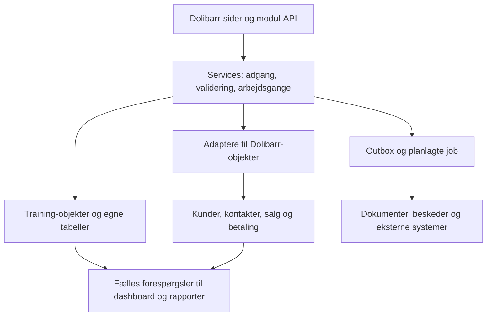
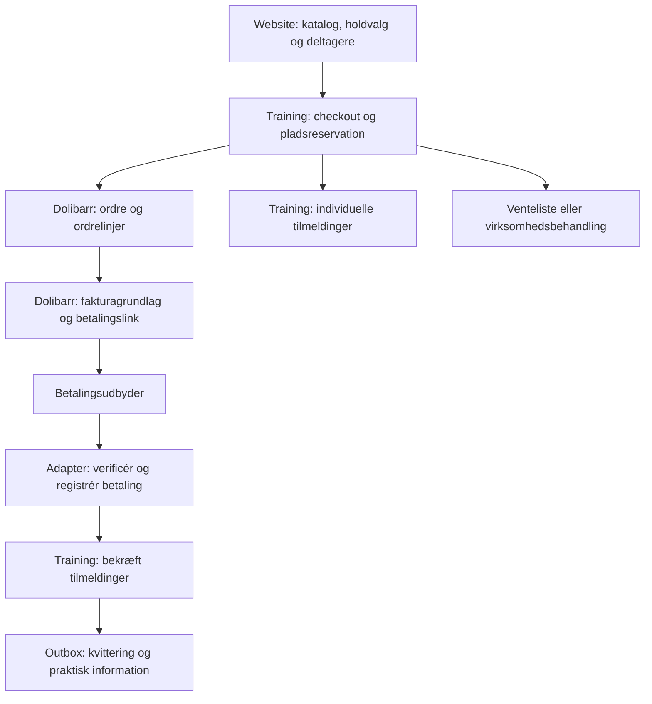

# Dolibarr TMS — arkitektur og datakortlægning

Beslutningsgrundlag • 4. oktober 2026 • Version 2.2 — test, drift, kommunikation og releasegrundlag

## Indhold

1. Arkitekturbeslutningen
2. Hvad materialet faktisk dokumenterer
3. Systemets opdeling
4. Datakortlægning: hvor kommer de viste oplysninger fra?
5. Dashboardets præcise kilder og formler
6. Hvilke oplysninger skal vi have registreret?
7. Foreslået logisk datamodel
8. Regler som implementationen skal håndhæve
9. Konkrete uklarheder og datakvalitet i screenshots
10. Implementation, opsætning og accept
11. Online tilmelding gennem Dolibarr Website
12. Ressourcer, statusovergange og styring af omfang
13. Prioriteret Fase 0-tjekliste og første prototyper
14. Fase 0 — gennemført standard- og gapkortlægning
15. Kilder og verificeringsgrænse
16. Risikoregister og operationel entity-model
17. Beslutningslog, åbne valg og standarddata ved opstart
18. Samlet master data dictionary
19. Performance- og driftsbilag
20. Persondata, opbevaring og rettighedsprocedure
21. Foreløbigt estimat og ressourceplan
22. Samlet teststrategi og releaseport
23. Deployment, backup, alarmer og incidentprocedure
24. Kommunikationsplan og leveringssemantik
25. Brugeropstart og accept af standarddata
26. Gennemgående eksempel og implementationsport
27. Versionshistorik og ordliste

## 1. Arkitekturbeslutningen

Byg ét eksternt Dolibarr-modul, `training`, som en modulær PHP-applikation i `htdocs/custom/training`. Dolibarr ejer kunder, kontakter, brugere, kurser som standardservices, kategorier, ressourcestamdata, CRM-salgsmuligheder, tilbud, salgsordrer, fakturaer, kreditnotaer og betalinger. Training-modulet ejer kursusindhold, kursusversioner, hold, undervisningsblokke, reservationer, tilmeldinger, fremmøde, bedømmelser og certifikater. Dolibarr Website er den valgte offentlige kanal til katalog og online tilmelding; den kalder de samme services som administrationen.

**Tilmeldingen er forbindelsen mellem undervisning og økonomi. Deltager, arbejdsgiver, køber og betaler er forskellige roller.** En person kan deltage i flere kurser og må ikke flyttes globalt fra “prospect” til “apprenant”, når én salgssag skifter fase.

Én autoritativ kilde pr. oplysning. Pris og program kopieres kun som bevidste, tidsbundne snapshots, når en aftale indgås eller et hold publiceres. Dashboardtal beregnes fra disse kilder.

Modulet skal udvikles fra bunden. De ti screenshots er krav- og designreferencer, ikke dokumentation for et eksisterende modul. Fase 0-standardkortlægningen er udført gennem officielle kilder; resultatet står i afsnit 14. Installationsversion, runtime og betalingsudbyder er endnu ikke oplyst. Der er ikke udført database- eller betalingstests. Alle navne med `llx_training_*` er **foreslåede tabeller**, ikke konstaterede eksisterende tabeller. `llx_` er dokumentationspræfiks; implementationen bruger Dolibarrs konfigurerede databasepræfiks.

## 2. Hvad materialet faktisk dokumenterer

| Billede | Synlig side | Hvad der er dokumenteret |
|---|---|---|
| 1 | Dashboard | Katalog, sessioner, deltagere, undervisere, lokaler, pipeline og diagrammer |
| 2 | CRM Formation | Kort med person, virksomhed, værdi og fase |
| 3 | Planning | Holdreference, kursus, startdato, lokale, underviser og status |
| 4 | Sessions-board | Hold fordelt på grupper, antal tilmeldte, kapacitet og procent |
| 5 | Kursuskatalog | Reference, titel, kategori, domæne, niveau, modalitet, beskrivelse, mål |
| 6 | Kursuskort | Desuden forudsætninger, målgruppe, program, timer, dage, priser, certificering og aktivstatus |
| 7 | Holdkort | Kursuslink, start/slut, klokkeslæt, underviser, lokale, sted, modalitet, pladser, pris og status |
| 8 | Fremmøde | Deltager, hold, dato, halvdag, status, ankomst, forsinkelse og signaturindikator |
| 9 | Evalueringer | Titel, hold, deltager, type, dato, maksimum, karakter og bestået |
| 10 | Fakturering | Fakturakladder, ubetalte fakturaer, “Total” samt tilmeldingsbeløb og betalingsstatus |

Menupunkter for certificeringer, undervisere, rapporter, parcours og pædagogiske moduler dokumenterer navigation; de dokumenterer ikke indholdet bag menuerne. Den vedlagte tekst er et input med hypoteser. Dens påstande om eksisterende integrationer og manglende funktioner er ikke behandlet som verificeret backend-adfærd.

## 3. Systemets opdeling

Services indeholder reglerne: `CatalogService`, `SchedulingService`, `EnrollmentService`, `BillingService`, `AttendanceService`, `AssessmentService`, `CertificateService` og `ReportingService`. Sider, API og import skal kalde de samme services. Adaptere skjuler Dolibarr-versionens feltnavne og metoder. Der skrives til økonomi gennem Dolibarrs objektmetoder, ikke med direkte SQL-opdateringer til fakturatabeller.

Service-laget holdes tyndt, men har eksklusivt ansvar for ændringer: `EnrollmentService` ændrer tilmelding og pladsforbrug; `SchedulingService` ændrer blokke og ressourcebooking; `BillingService` beregner og fryser aftalepris samt ændrer økonomiallokeringer. Et checkout koordinerer disse services og implementerer ikke reglerne igen. Repositories udfører persistence og må ikke blive en alternativ adgang til at omgå valideringen. Et databaseconstraint er en ekstra garanti, ikke en erstatning for reglerne.

Brug hooks til faner, knapper og integration i eksisterende sider; brug triggers til relevante Dolibarr-forretningshændelser. Bekræft konkrete hook-contexts og trigger-navne mod installationsversionen. Eksterne kald udføres efter commit gennem en outbox med retry og idempotens. Ingen separat microservice-infrastruktur er nødvendig til første version.

## 4. Datakortlægning: hvor kommer de viste oplysninger fra?

“Standard” betyder en Dolibarr-kilde, der findes som standardkoncept. Det betyder ikke, at data er udfyldt hos jer. “Modul” betyder anbefalet registrering i training. “Beregnet” betyder, at feltet ikke bør vedligeholdes manuelt.

### 4.1 Katalog og kursuskort — billeder 5 og 6

| Vist oplysning | Autoritativ kilde | Registrering / regel |
|---|---|---|
| CAT-reference, titel | Standard: service `Product.ref`, `Product.label` | Kurset er servicen; course-profilen tilføjer kun undervisningsdata |
| Aktiv | Service til salg + profilens publiceringsstatus | Kommerciel salgbarhed og faglig publicering er separate beslutninger |
| Kategori | Standard kategorier til den tilknyttede service | Genbrug en kursus-kategoristruktur; konkret mapping kontrolleres |
| Domæne | Modul: `course_version.domain_code` | Fagområde med kodeliste; afklar forskellen fra kategori |
| Niveau | Modul: `course_version.level_code` | Kontrolleret kodeliste |
| Modalitet | Modul: `course_version.default_modality` | Fysisk, online, blandet; hold kan have eget snapshot |
| Beskrivelse, mål | Standardservice for salgsbeskrivelse; modulversion for fagligt program og mål | Ingen anden master for samme salgsbeskrivelse; historiske snapshots er tilladt |
| Forudsætninger, målgruppe | Modul: `prerequisites`, `target_audience` | Registreres med programmet |
| Program | Modul: `course_version` + `course_unit` | Ordnet program; fritekst kan være minimumsversion |
| 14 timer / 2 dage | Modul: `duration_minutes`, `nominal_days` | Faktiske undervisningsminutter er grundlag; dage er planlægningsoplysning |
| Pris HT / pris pr. person | Standard salgsservice + eksplicit prisenhed | Listepris ekskl. moms, valuta og enhed: pr. deltager eller pr. hold |
| Certifiante | Modul: versionens `certificate_policy_id` | Flag siger kun, at bevis kan udstedes; krav og bevisudstedelse lagres separat |

En salgsservice ligger i Dolibarrs `llx_product`, der dækker både produkter og services. Kursets identitet er denne service; `course_profile.fk_product` er en entydig udvidelse, ikke en anden kursusstamme. Katalogets to prisfelter må kun være ens, hvis begge faktisk betyder listepris pr. deltager. Holdpriser og aftalepriser er eksplicitte overrides; ændringer i listepris må ikke ændre historiske tilmeldinger.

### 4.2 Hold, board og planlægning — billeder 3, 4 og 7

| Vist oplysning | Autoritativ kilde | Registrering / regel |
|---|---|---|
| SES-reference og titel | Modul: `session.ref`, `label` | Unik reference pr. entity |
| Kursusreference / titel | Modul: `session.fk_course_version` → kursus | Hold bindes til en publiceret version |
| Start/slutdato, start/sluttid | Modul: `session_slot.start_at`, `end_at` | Én række pr. reel undervisningsblok; vis minimum og maksimum på holdkort |
| Formateur | Modul: reservation → trainer → kontakt/bruger | Flere undervisere pr. hold og forskellige blokke understøttes |
| Salle | Modulreservation → standard `Dolresource` | Standardressourcen ejer navn/type; kapacitet og bookingregler tilføjes |
| Lieu | Modul: venue/adresse, knyttet til blok | Gem tidsbundne adresseoplysninger ved publicering; online-link har særskilt adgang |
| Modalitet | Modul: hold/blok | Kopieres fra kursus som default; tillad fysisk og online i samme hold |
| Places max | Modul: `session.max_participants` | Kontrolleres mod lokalekapacitet og undervisningsform |
| Inscrits: fx 3 / 8 | Beregnet fra aktive, pladsforbrugende tilmeldinger | Ingen manuelt opdateret tæller; venteliste og afbud tæller ikke |
| Belægningsprocent | Beregnet: pladsforbrug / kapacitet × 100 | Vis “ikke defineret” ved nul eller manglende kapacitet |
| Holdpris HT | Modul: `session_price` eller standardservice som default | Enhed, valuta, moms og gyldighed kræves; ikke lig med samlet omsætning |
| État, Clôture, terminée | Modul: arbejdsgangsstatus + tidsstatus | Statusetiketter og farver har samme definition på alle sider |
| Grupper Prévue, Ouverte, Complète | Arbejdsgang og separat kapacitetsindikator | “Fuldt” beregnes fra kapacitet; “lukket for tilmelding” er en beslutning |

Et hold med 14 timers undervisning bør ikke modelleres som et sammenhængende datointerval med daglig 09–17 uden de faktiske undervisningsblokke. Blokke sikrer korrekt fremmøde, pauser, undervisertimeforbrug og konfliktkontrol.

### 4.3 Deltagere og CRM — billeder 1 og 2

| Vist oplysning | Autoritativ kilde | Registrering / regel |
|---|---|---|
| Personnavn | Standard: `llx_socpeople` | Én personidentitet med deltagerprofil; kontakt behøver ikke virksomhedstilknytning |
| Virksomhedsnavn | Standard: `llx_societe` via salgssagens køber | Er ikke nødvendigvis arbejdsgiver eller betaler |
| APP-reference | Modul: `learner.ref`, `fk_socpeople` | Profil uden kopi af navn, e-mail og telefon |
| FORM-reference | Modul: `trainer.ref` | Intern underviser genbruger User; ekstern genbruger Contact og evt. leverandør |
| Prospect / Contact / Devis | Standardprojekt som opportunity med fasekodeliste | Kursusspecifik relation i profil; fase tilhører salgssagen |
| Inscription / Apprenant | Afledt milepæl fra tilmelding / faktisk start | Kan vises i salgstavlen, men bevarer egne domænestatusser |
| Grøn værdi på kort | Standardprojektets `opp_amount` og eventuelt tilbud | Angiv valuta og beløbsgrundlag; probability genbruges fra projekt |
| Antal og sum pr. kolonne | Beregnet pr. unik salgssag | Samme person kan have flere sager; én sag optræder kun én gang |

Tilbud genbruges fra Dolibarr `llx_propal` / `llx_propaldet`. En kursussalgssag bruger standardprojektets opportunity-funktion som master. Training tilføjer relation til service, hold og tilmeldinger; fase, værdi og sandsynlighed duplikeres ikke.

### 4.4 Fremmøde — billede 8

| Vist oplysning | Autoritativ kilde | Registrering / regel |
|---|---|---|
| PRE-reference | Modul: `attendance.ref` | Identificerer en registrering |
| Session / Apprenant | `attendance.fk_enrollment` → hold og deltager | Fremmøde kræver gyldig tilmelding |
| Dato / halvdag | `attendance.fk_session_slot` | Matin/après-midi er visning af en tidsblok; ikke selvstændig kalenderkilde |
| Present / absent / excuse / retard | Modul: `attendance.status` | “Ikke registreret” er særskilt fra “fraværende” |
| Ankomst | Modul: `arrival_at` | Fraværende person skal ikke automatisk have ankomst kl. 09 |
| Retard (min) | Beregnet mod blokstart | Korrigeret værdi kræver årsag og historik |
| Signé | Modul: `evidence` linket til fremmøde | Faktisk fil/kvittering, tidspunkt, underskriver og dokumentversion; et flag er ikke bevis |

Supplér med afgang, tilstedeværende minutter, registrator og valideringstidspunkt. Der må højst være én aktuel fremmøderegistrering pr. tilmelding og blok; rettelser gemmes som historik.

### 4.5 Evaluering — billede 9

| Vist oplysning | Autoritativ kilde | Registrering / regel |
|---|---|---|
| EVA-reference, titel, type | Modul: `assessment` / `assessment_definition` | Definition adskilles fra den enkelte deltagers forsøg |
| Session, deltager, dato | Modul: `assessment_attempt.fk_enrollment`, `assessed_at` | Forsøg knyttes til den rigtige kursusversion og tilmelding |
| Note maximale | Versioneret vurderingsdefinition | Maksimum og tærskel fryses for forsøget |
| Note | Modul: `assessment_attempt.score` | Intervalvalidering; ikke udfyldt er ikke nul |
| Réussi | Beregnet med den gemte regelversion | Bestågrænse, eventuel vægtning, obligatoriske dele og godkendelse |

Supplér med forsøgsnummer, bedømmer, godkendelsesstatus, dokumentation og begrundelse ved rettelser. Certifikat beror på definerede krav og godkendte resultater, ikke blot et grønt ikon.

### 4.6 Fakturering og tilmelding — billede 10

| Vist oplysning | Autoritativ kilde | Registrering / regel |
|---|---|---|
| INS-reference, deltager, État | Modul: `enrollment` → learner | Tilmeldingsstatus er adskilt fra finansiering og betaling |
| Montant HT | Modul: accepteret prissnapshot på tilmelding | Prisgrundlag, antal, rabat, moms og valuta; afstemmes mod faktureret beløb |
| Attente / partiel / payé | Beregnet fra relevante fakturaer og allokeringer | Ikke faktureret, faktureret ubetalt, delvist afregnet, fuldt afregnet vises særskilt |
| Financé | Modul: `funding_share.status` | Finansieringsgodkendelse; kan samtidig være ubetalt |
| Factures — Brouillon | Standard: `llx_facture`, filtreret til kursusrelation | Antal unikke kladder; ikke salg eller indbetaling |
| Factures impayées | Standard: fakturaens restsaldo og status | Afklar “åben” kontra “forfalden”; vis begge hvis nyttigt |
| Total 48.720,00 | Kræver definition før implementation | Anbefalet etiket: “Nettofaktureret HT i perioden”; separat indbetalt og restsaldo |
| Devis / Factures / Avoirs / Paiements | Dolibarr-standardobjekter med modulfiltre | Genbrug dokumenter, nummerserier og betalingslogik |

`llx_facture` indeholder fakturahoved, `llx_facturedet` linjer, `llx_paiement` betalinger og `llx_paiement_facture` relation/beløb mellem betaling og faktura. TMS skal tilføje relationer på **linjeniveau** mellem tilbud/fakturalinjer og tilmeldinger eller hold. Et headerfelt med hold-ID er utilstrækkeligt til samlefakturering.

Hvis én fakturalinje dækker flere deltagere, registreres hver deltagers andel. Betaling på en samlefaktura fordeles kun på tilmeldinger efter en eksplicit regel eller manuel allokering. Gem allokeret beløb inkl. moms og metode; allokering må ikke overstige den faktisk afregnede fakturasaldo. Kreditnotaer, modregning, depositum og refusion håndteres gennem Dolibarrs økonomilogik. “Afregnet” betyder ikke altid kontant indbetalt.

## 5. Dashboardets præcise kilder og formler

Alle KPI'er deler filtre for entity, adgang, periode, timezone og statuser. Vis periode og opgørelsestidspunkt. Der må ikke summeres på tværs af valuta uden en dokumenteret kurs.

| KPI i billede 1 | Anbefalet beregning | Nødvendigt input |
|---|---|---|
| 20 kurser i katalog | Antal unikke aktive kurser, ikke kursusversioner | Aktivstatus og publicering |
| 60 sessioner | Antal hold i valgt scope | Afklar totalbestand eller periode |
| 7 igangværende | Ikke aflyst, start ≤ nu < slut; mærkes som tidsstatus | Faktiske blokke og timezone |
| 19 kommende | Ikke aflyst, første blokstart > nu | Samme tidsreference på alle sider |
| 120 deltagere | Unikke deltagerprofiler i angivet scope | Identitetslink; ikke antal tilmeldinger |
| 7 tilmeldinger denne måned | Oprettede tilmeldinger efter `created_at` | Lokal månedsgrænse; nye bekræftede er en anden KPI |
| 25 undervisere | Unikke aktive underviserprofiler | Aktivstatus og personlink |
| 86 åbne prospects | Unikke åbne salgssager | Eksplicit åbne faser; i billedet 30 + 28 + 14 + 14 = 86 |
| 8 ledige lokaler | Ressourcer uden overlap i valgt interval | Tidsinterval, kapacitet, vedligehold og reservationer |
| Pipeline antal / værdi | Antal sager og sum pr. fase | Valuta, åbent/lukket og værdiens grundlag |
| Månedlige tilmeldinger | Antal efter oprettelsesmåned | Samme tælledefinition som månedens kort |
| Mest efterspurgte kurser | Bekræftede tilmeldinger grupperet pr. kursus | Vis periode; efterspørgsel via leads er en anden måling |
| Belægning | Sum pladsforbrug / sum kapacitet i samme holdudvalg | Brug vægtet ratio, ikke gennemsnit af holdprocenter |

Bevar et fælles rapporteringslag; undgå én separat SQL-definition pr. skærm. Aggreger tilmeldinger, fremmøde og økonomilinjer hver for sig før join, så en deltager med ti fremmøderækker ikke giver ti gange omsætningen.

## 6. Hvilke oplysninger skal vi have registreret?

Nedenstående er registreringskrav eller kontrolpunkter. At de ikke ses på screenshots beviser ikke, at de mangler i databasen.

| Prioritet | Oplysninger der skal findes | Placering | Hvem registrerer / hvornår | Hvad de muliggør |
|---|---|---|---|---|
| P0 | Stabil personidentitet, navn, e-mail efter behov, personlink | Standardkontakt + learner-profil | Administration / import | Deltagerhistorik uden dubletter |
| P0 | Køber, arbejdsgiver ved tilmelding, betaler(e), andele og valuta | Third parties + enrollment + funding_share | Salg før bekræftelse | Korrekt B2B/B2C-fakturering |
| P0 | Kursusversion, prisenhed, aftalepris, rabat, momsgrundlag | Course version + service + enrollment snapshot | Kursusansvarlig / salg | Historisk korrekt aftale |
| P0 | Faktiske undervisningsblokke, timezone, pauser og modalitet | session_slot | Koordinator før publicering | Planlægning og fremmøde |
| P0 | Lokaleegenskaber, kapacitet, udstyr, underviserkompetencer, tilgængelighed | resource, trainer, reservation | Koordinator / underviser | Konfliktkontrol og egnet booking |
| P0 | Tilmeldingsstatus, datoer, pladsforbrug, ventelisteorden | enrollment | Administration ved tilmelding | Rigtig belægning og oprykning |
| P0 | Tilbuds- og fakturalinks på linjeniveau, beløbsandele | billing_allocation | System ved dokumentoprettelse | Afstemning uden dobbelttælling |
| P0 | Beståkrav, fremmødekrav, bedømmer, godkendelse og bevisgrundlag | assessment + certificate_policy | Kursusansvarlig / underviser | Dokumenteret gennemførelse |
| P0 | Faktiske fremmødeminutter, registrator, tidspunkt og signaturbevis | attendance + evidence | Underviser pr. blok | Fremmødebevis og sporbar rettelse |
| P0 | Aktør, ændringstid, gammel/ny værdi, årsag | audit_event | Automatisk på alle kritiske ændringer | Revisionsspor |
| P1 | Certifikatnummer, udsteder, tidspunkt, gyldighed, filhash, tilbagekaldelse | certificate | Autoriseret udsteder | Bevisets livscyklus |
| P1 | Afbudsregel, frist, ombooking, refusion og historisk relation | Policy + enrollment_transfer | Salg / administration | Konsistent ændring af aftaler |
| P1 | Sprog, kontaktkanal, skabelonversion, leveringsstatus | communication_job | Administration + automatisk | Bekræftelser og påmindelser |
| P1 | Budget og faktiske underviser-, lokale-, rejse- og materialeomkostninger | cost_allocation + standardbilag | Koordinator / økonomi | Dækningsbidrag pr. hold |
| P1 | Formål, relevant datagrundlag, opbevaringsklasse, særskilte samtykker hvor relevant | privacy metadata + consent_event hvor relevant | Administration efter fastlagt politik | Styret dataopbevaring; ikke et generelt samtykkeflag |
| P2 | Tilfredshed, klage, ansvarlig, handling, deadline og effekt | survey / standardticket + relation | Kvalitetsansvarlig | Kvalitetsopfølgning |
| P2 | Eksterne system-ID'er, synkroniseringsversion og status | external_link | Integration | Genkørbar import/eksport |

Extrafields egner sig til få supplerende felter på eksisterende kunder, kontakter og services. Tilmeldinger, blokke, fremmøde, forsøg og finansieringsandele er relationer med egen livscyklus og skal have egne tabeller. Land, finansieringsordninger og eventuelle certificeringskrav skal afklares før konkrete rapporter eller integrationer specificeres; billederne blander fransk UI og et sted i Casablanca.

## 7. Foreslået logisk datamodel

Alle modulobjekter bruger relevant `entity`, teknisk ID, oprettelses-/ændringstid og aktør. Referencer er unikke pr. entity. Alle relationer validerer entity; en klient kan ikke vælge en anden virksomheds data med et ID.

| Foreslået tabel | Kernefelter / relationer |
|---|---|
| training_course_profile | unik fk_product pr. entity; publiceringspolitik og link til aktuel kursusversion; ingen kopi af standardreference/titel/pris |
| training_course_version | fk_course_profile, version_no, titel/program-snapshot, indhold, varighed, niveau, modalitet, policy, published_at |
| training_course_unit | fk_course_version, rækkefølge, titel, varighed |
| training_session | ref, fk_course_version, label, workflow_status, max_participants, registration_deadline |
| training_session_slot | fk_session, start_at, end_at, timezone, planned_minutes, modality, venue snapshot |
| training_trainer | ref, type, status; intern identitet via fk_user, ekstern via fk_socpeople; optional fk_supplier; undgå obligatorisk kontaktkopi af intern bruger |
| training_resource_profile | unik fk_resource til standardressource; kursuskapacitet, venue og buffere; enkeltfelter kan være resource-extrafields |
| training_reservation | fk_slot, resource_type, resource_id, start_at, end_at, buffer, status |
| training_availability | trainer/resource reference, start_at, end_at, available/unavailable, reason |
| training_learner | ref, fk_socpeople, status; persondata læses fra kontakt |
| training_opportunity_profile | unik fk_project; fk_course_service/fk_session, forventet afslutning hvis ikke passende standardfelt; ingen kopi af fase/værdi/probability |
| training_opportunity_document | opportunity og Dolibarr-tilbud/linje; håndterer tilbudsversioner |
| training_enrollment | ref, fk_session, fk_learner, fk_buyer, fk_employer_at_booking, status, price snapshot, created/confirmed/cancelled_at |
| training_funding_share | fk_enrollment, fk_payer, amount, currency, approval_status, funding_reference |
| training_billing_allocation | fk_enrollment/funding_share, document_type, fk_document_line, allocated_ht/ttc, role |
| training_settlement_allocation | fakturaallokering, afregningskilde, allokeret TTC-beløb, metode, tidspunkt |
| training_attendance | fk_enrollment, fk_slot, status, arrival/departure, present_minutes, validated_by/at |
| training_assessment_definition | fk_course_version, type, max_score, threshold, required, rule_version |
| training_assessment_attempt | fk_definition, fk_enrollment, attempt_no, score, assessed_by/at, approval_status, frozen_rule |
| training_certificate | fk_enrollment, serial, policy_version, evidence snapshot, issued_by/at, expiry, revoked_at/reason, filehash |
| training_evidence | object type/ID, dokumentreference, hash, dokumentversion, aktør, timestamp |
| training_cost_allocation | fk_session, kategori, budget/faktisk, amount_ht, currency, kildebilag/linje eller intern timesats |
| training_audit_event | object, action, actor, occurred_at, before/after, reason, correlation_id |
| training_outbox | event_id, type, payload, created_at, attempts, next_attempt, delivered_at |
| training_external_link | system, external_id, objecttype/id, source_version, sync_status |
| training_retention_policy | purpose_code, basis_reference, retention_class, trigger, duration/review_rule, policy_version, approver |
| training_privacy_request | identity_check, scope, handler, received_at, outcome; minimér logindhold og giv den egen retention |

Modellen kan opdeles i P0/P1-migrationer. Tabellenavne er ikke et færdigt SQL-schema. Felttyper, indeks, FK'er og API-kontrakter fastlægges på den konkrete database og Dolibarr-version.

## 8. Regler som implementationen skal håndhæve

### Kapacitet og booking

- Bekræftelse af tilmelding låser kapacitetskontrollen i en transaktion. To samtidige bookinger må ikke begge tage sidste plads. Ventelisteoprykning bruger samme regel.
- Ressourceoverlap: ny start < eksisterende slut OG ny slut > eksisterende start. Medtag opsætning, oprydning og relevante rejsebuffere. Reservation kan ikke godkendes alene efter et UI-check.
- Holdets maksimum kan ikke overstige gyldig fysisk kapacitet uden en eksplicit godkendt regel. Online og blandede hold bruger passende kapacitetsregler.
- “Ledigt lokale” kræver valgt dato og interval; ledighed er ikke et permanent ja/nej-felt.

### Statusmodeller

| Domæne | Anbefalede statusser | Afledt separat |
|---|---|---|
| Hold | draft → planned → registration_open → registration_closed → completed → archived; cancelled | kommende, igangværende, afsluttet tidsinterval; fuldt |
| Tilmelding | requested → waitlisted/reserved → confirmed → completed; cancelled/no_show | betalingsstatus, finansieringsstatus og bestået |
| Salgssag | prospect → contacted → quoted → won/lost | tilmelding oprettet, undervisning startet |
| Certifikat | eligible → approved → issued → revoked/expired | offentlig verificeringsstatus |

Tidens passage må ikke automatisk betyde dokumenteret gennemførelse. Ombooking lukker den gamle tilmelding med årsag og opretter en ny med link til den gamle; fremmøde og økonomihistorik bevares.

### Økonomi

- Accepteret pris fryses ved bekræftelse. Genfakturering af samme grundlag forhindres med en entydig idempotensnøgle.
- Én køber kan købe et helt hold; én fakturalinje kan dække flere deltagere; én tilmelding kan have flere betalere. Fordeling skal være eksplicit og summerne afstemmes.
- Nettofaktureret HT: relaterede validerede almindelige fakturalinjer minus relevante kreditnotaer i den valgte periode, med tydelig behandling af depositum og erstatningsfakturaer. Det er ikke en automatisk beregning af regnskabsmæssigt indtægtsførte ydelser.
- Åben restsaldo og indbetalinger beregnes med Dolibarrs gældende afregningslogik. Kladder indgår ikke i faktureret omsætning.
- Dækningsbidrag pr. hold bruger nettopris/indtægt og direkte omkostninger på samme valuta- og periodegrundlag. Vis budget separat fra faktisk. Break-even = faste direkte omkostninger / (nettopris pr. deltager − variable direkte omkostninger), rundet op; ikke beregnelig ved nul/negativt bidrag pr. deltager.

### Dokumentation og adgang

- Underviser ser egne hold og nødvendige deltagerdata; økonomirettigheder er særskilte. Koordinator styrer booking; certifikatudsteder har egen rettighed; eksport kræver eksplicit adgang.
- Kontrol gælder på serveren i sider, API, dokumentdownload og eksport. Kundeportal begrænses til aftalte data for egen kunde; deltagerportal til egne data.
- Publicerede kursusversioner er uforanderlige. Kritiske rettelser kræver årsag og audit. Append-only log med begrænsede rettigheder giver sporbarhed; hash alene garanterer ikke uforanderlighed over for databaseadministratorer.
- Certifikat snapshotter identitet og kriterier ved udstedelse. Tilbagekaldelse ændrer status, ikke historisk udstedelse. Undgå automatisk offentlig eksponering af persondata.
- Beskedudsendelse gemmer skabelonversion og udfald. Idempotent enqueue forhindrer gentagne beskedjobs; uklart udfald hos mailafsenderen håndteres efter leveringsreglerne i afsnit 24.

## 9. Konkrete uklarheder og datakvalitet i screenshots

| Observation | Konsekvens | Afklaring / rettelse |
|---|---|---|
| Dashboard dateret 8. juli, mens “kommende” starter 2.–7. juli | Filter eller status kan være misvisende | Samme klokke, timezone og tidsdefinition på begge sider |
| “Complètes” viser 7/12 og 15/16 | Gruppen kan ikke uden videre betyde fuldt booket | Afklar ordets betydning; skil tilmeldingslukning fra kapacitetsstatus |
| Kursus 14 timer / 2 dage, hold 29.–31. maj, 09–17 | Man kan ikke udlede reel undervisningstid | Registrer de faktiske blokke og pauser |
| Fremmøde ved SES-2026-00060 ses 10. maj; samme hold ses med start 27. juli | Historik kan være inkonsistent eller demo-data | Fremmøde skal ligge i en blok for det tilknyttede hold |
| Excusé / absent har ankomst 09:00 | Defaultværdi kan ligne faktisk fremmøde | Ankomst er tom, medmindre registreret faktisk |
| “Financé” står ved siden af “Payé” | Finansieringsaftale kan forveksles med afregning | Separate kolonner: finansiering og afregning |
| “Total” uden HT/TTC, periode eller valuta | Økonomital kan ikke afstemmes | Præcis KPI-label og drilldown til grundlag |
| Kategori og domæne gentager samme værdier | To felter kan blive vedligeholdt forskelligt | Enten ét begreb eller dokumenteret forskel |
| Excel avancé står som Débutant; Python débutants som Avancé | Niveau kan være fejlkodet | Faglig validering før publicering |
| Certifiante-kort viser “Valider” | Handling og status kan være blandet | Vis værdi; handling er en separat knap med rettighed |

Dette er observationer om skærmenes konsistens, ikke en konstatering af produktionsfejl.

## 10. Implementation, opsætning og accept

### Fase 0 — kortlæg standard og kvalificér målmiljø

Kortlæg standard-Dolibarr mod kravene; der er intet eksisterende kursusmodul at migrere. Den udførte kildebaserede kortlægning står i afsnit 14. Næste tekniske verifikation er at fastlåse målversion og testmiljø, aktivere relevante standardmoduler og teste de valgte adaptere. Brug syntetiske B2C/B2B-bookinger til at bevise kæden service → hold → tilmelding → ordrelinje → fakturalinje → betaling.

**Fase 0-status:** Standard-/gapmatrix, registreringspunkter og genbrugsbeslutninger er udarbejdet. Teknisk kvalificering af målversion, database, Website og betalingsudbyder samt prototyper er ikke kørt. Der kræves ingen eksisterende modulkode eller historisk bookingdatabase. Et bindende implementationsestimat afventer teknisk kvalificering.

### Fase 1A — datakernen og administrativ booking

Afgrænset leverance: person-/kundelinks og learner/trainer-profiler; kursus, publiceret version og ordnede units; hold og faktiske blokke; basislokaler og reservationer; tilmelding og atomisk kapacitetskontrol; accepteret prissnapshot og økonomiallokering på linjeniveau; basisfremmøde; audit, entity og rettigheder samt fælles rapportforespørgsler.

Basisfremmøde omfatter status, tilstedeværende minutter, registrator og rettelseshistorik. Avanceret elektronisk signering kan vente; eksisterende bevisfiler bevares ved import. Basisrapportering begrænses til tilmeldinger, hold, belægning og afstemt fakturering med drilldown. Der bygges ikke en generel rapportdesigner eller et selvstændigt datavarehus.

Opsætning bruger installationsmigrationer og syntetiske testdata. Eksisterende Dolibarr-kunder/services genbruges, hvis sådanne findes; screenshots omsættes ikke til historiske produktionsregistreringer. Fase 1A er en intern, verificerbar milepæl; den opfylder ikke alene målet om online tilmelding.

### Fase 1B — online booking via Dolibarr Website

Katalog, konkret holdvalg, navngivne deltagere, ét hold pr. checkout, kortbetaling gennem én valgt udbyder og fakturabetaling for administrativt godkendte virksomheder. Genbrug Fase 1A's services og tilmeldinger. Tilføj tidsbegrænset pladsreservation, ordrelinjer og relationer, betalingsverificering, idempotens, afstemningsjob, kvitteringsside og én transaktionel bekræftelsesmail.

Minimum outbox og jobdrift følger med disse funktioner: ellers kan en kunde have betalt uden en stabil bekræftelse, eller pladser være låst efter et afbrudt checkout. Automatiske påmindelser og kampagner indgår ikke. Fuldt hold viser “udsolgt”; venteliste kan håndteres manuelt, indtil Fase 2. Online finansiering, unavngivne pladser, flere hold i kurven og offentlig kundeportal udskydes.

**Driftsport:** Fase 1A's relevante acceptkriterier og alle online-kriterier i afsnit 11.9 er opfyldt, inklusive manuel fakturabetaling, sene betalingshændelser og samtidighed mellem online og administrativ booking. Certifikatkriteriet testes, når certifikatudstedelse implementeres i Fase 2; allerede migrerede certifikater må ikke ændres af Fase 1.

### Fase 2 — dokumentation og automatisering

Versionerede bedømmelsesregler og certifikater, avancerede signaturbeviser, påmindelser, automatisk ventelisteoprykning, selvbetjent ombooking og omkostningsallokering. Derefter portal og integrationskontrakter efter behov. Kvalitetsrapportering, offentlige kursusportaler og landespecifikke udvekslingsformater kommer efter afklaring af konkrete krav.

Datamodellen i afsnit 7 beskriver målarkitekturen. Den er ikke en ordre om at bygge alle tabeller i Fase 1. Kun tabeller og felter, som den afgrænsede leverance bruger, oprettes; relationer og migrationsmuligheder bevares til senere udvidelser.

### Acceptkriterier

1. Hvert dashboardtal har drilldown, og antal/beløb stemmer med detailvisningen under samme filtre.
2. En person på to hold tæller som én person og to tilmeldinger; vedkommende kan samtidig have en åben salgssag.
3. To samtidige forsøg på sidste plads giver én bekræftelse og én afvisning/ventelisteplacering.
4. Samlefaktura til én virksomhed med flere deltagere tælles én gang; HT/TTC, kreditnota og delbetaling kan afstemmes til Dolibarr.
5. Finansieringsgodkendelse ændrer ikke en ubetalt faktura til betalt.
6. Fremmøde kan ikke registreres på en anden sessions blok; ukendt fremmøde er ikke fravær.
7. Ændring af katalogpris eller program ændrer ikke eksisterende accepterede aftaler og publicerede hold.
8. Bedømmelsesrettelse efter certifikatudstedelse skaber en kontrolleret revurdering; certifikathistorikken bevares.
9. En underviser kan ikke hente andre underviseres hold eller økonomi gennem et manipuleret ID.
10. Genkørsel af import, fakturaoprettelse eller beskedjob skaber ikke dubletter.

## 11. Online tilmelding gennem Dolibarr Website

### 11.1 Beslutning og ansvarsfordeling

Dolibarr Website er valgt af brugeren. Website-modulet er en CMS med mulighed for dynamisk indhold fra Dolibarr; det må ikke antages at levere den komplette kursus-checkout som standard. Kursusmodulet leverer de offentlige funktioner til holdvalg, tilmelding, reservation, checkout og kvittering. Dolibarrs installerede betalingsmodul genbruges gennem en adapter, der verificeres mod version og udbyder.

| Del | Ansvar | Masterdata |
|---|---|---|
| Website-sider | Layout, markedsføring, søgning, formularer og visning af kvittering | Website-containere og offentlige kursusdata |
| Training public controller | Afgrænset adgang, validering og checkout-session | Serverbestemt website/entity og udløbende sessiontoken |
| Training services | Prisberegning, pladsreservation, deltagere og tilmeldingsregler | Eksisterende training-objekter; ingen separat webshopbestand |
| Dolibarr salgsordre | Kommerciel bestilling fra køber | Standardordre og ordrelinjer |
| Dolibarr faktura/betaling | Økonomidokument, restsaldo og registreret afregning | Standardfaktura og betalingsobjekter |
| Payment adapter | Forbindelse til udbyderens checkout og verificerede udfald | Transaktions-ID, beløb, valuta og dokumentrelation |
| Outbox/job | Bekræftelse, påmindelse, udløb og afstemning | Én behandlet hændelse pr. event-ID |

Website-skabeloner indeholder kun præsentation og kald til det offentlige modulinterface. Pris-, booking- og betalingsregler ligger i versionsstyret modul-kode. Offentlig adgang bruger en begrænset applikationskontekst; en CMS-global `$user` må aldrig tolkes som kundens identitet eller tilladelse. Browseren får ikke en Dolibarr-administrators API-nøgle.

Ordre, faktura og tilmelding har egne statusser. Betalt ordre betyder ikke gennemført kursus. Et afsluttet kursus betyder ikke, at alle fakturaer er afregnet.

### 11.2 Sammenhængen mellem kursus, hold, service og ordre

**Kursus = fagligt indhold. Hold = konkret levering. Service = salgbart økonomiobjekt. Ordrelinje = bestilte pladser. Tilmelding = én persons plads på ét hold.**

Brug en kursusservice som salgsprodukt. Det valgte hold identificeres eksplicit på ordrelinjen via modulrelation, eventuelt suppleret med et extrafield til visning. Nye hold kræver ikke automatisk nye serviceprodukter. Hvis holdet har anden pris, gemmes den som den accepterede linjepris og tilmeldingssnapshot.

Eksempel: En virksomhed køber tre pladser på Excel-hold SES-2026-00041. Én ordrelinje indeholder service, hold, antal 3 og prissnapshot. Modulet opretter tre tilmeldinger til hver sin deltager og kobler dem til linjen. Fakturaen udstedes til køber/betaler, ikke automatisk til deltagerne. De tre navne vises kun i godkendte dokumenter og aldrig i det offentlige katalog.

Første version kræver deltagernes navne ved checkout. Hvis virksomheden skal kunne købe unavngivne pladser, skal et særskilt seat-allocation-objekt holde pladserne frem til navngivning; fiktive deltagerprofiler må ikke oprettes som pladsholdere.

### 11.3 Offentlig visning: datakilder og publiceringsregler

| Website-oplysning | Kilde | Regel |
|---|---|---|
| Kursustitel, beskrivelse, mål, program og forudsætninger | Publiceret course_version | Kun godkendt og publicerbart indhold |
| Holddatoer, undervisningstider og modalitet | session + session_slot | Publiceret hold, fremtidig start og gyldig tilmeldingsperiode |
| Sted | Godkendt offentligt venue-felt | Interne noter og mødelinks vises ikke automatisk |
| Pris og valuta | Serverens price quote fra service/hold og køberkontekst | Enhed, HT/TTC og moms vises tydeligt; genberegnes ved checkout |
| Ledige pladser | Kapacitet minus bekræftede pladser og gyldige holds | Website-cache er vejledende; checkout bruger transaktionel kontrol |
| Tilmeld / venteliste | enrollment policy + kapacitet + deadline | Ikke kun et manuelt website-flag |
| Underviserpræsentation | Godkendt public profile | Kontaktdata og interne oplysninger er ikke offentlige |
| Afbuds- og handelsbetingelser | Versionsbestemt policy | Den accepterede version gemmes på checkout |

Tilføj `publication_status`, `website_id`, `public_slug`, publiceringstid, offentlige tekster samt `online_registration_enabled`, `registration_opens_at`, `registration_closes_at` og `booking_policy_id` til relevante modulobjekter. Entity bestemmes af website-konfiguration på serveren, ikke af et brugerindsendt felt.

### 11.4 Tilmeldingsflowet

1. Besøgende vælger kursus og et konkret hold. Systemet viser dato, sted, pris og tilmeldingsvilkår.
2. Besøgende vælger antal og angiver deltagere samt køber/betaler. “Jeg deltager selv” er en genvej; køber og deltager bevares som separate roller.
3. Serveren beregner et tilbud på den aktuelle pris: hold, antal, pris pr. enhed, rabat, moms, total, valuta og gyldighed. Ændret pris kræver accept før fortsættelse.
4. Ved indsendelse oprettes en checkout og en tidsbegrænset pladsreservation i én transaktion. Reservation opstår ikke ved blot at åbne katalog eller lægge i kurven. Reservationstiden er konfigurerbar, eksempelvis 15 minutter for kortbetaling.
5. Serveren opretter eller forbinder kunder/kontakter, opretter standardordre og linjer samt de individuelle reserverede tilmeldinger. Dokumentskabende trin er idempotente og genkørbare efter fejl.
6. Ved kortbetaling oprettes fakturagrundlag og et objektbundet betalingslink gennem standardfunktionerne. Standardforløbet foreslås fakturabaseret, så betalingen kan afstemmes direkte. Tidspunkt for validering og håndtering af ubetalte fakturaer fastlægges med økonomi og den installerede betalingsadapter.
7. Betaling verificeres gennem betalingsmodulets udbyderkontrol eller verificerede serverhændelse. Browserens retur til en success-side er kun navigation og er ikke bevis for betaling.
8. Den verificerede betaling registreres én gang i Dolibarr; systemet kontrollerer reservationen og bekræfter tilmeldingerne. Outbox udsender ordrebekræftelse/tilmeldingsbekræftelse og nødvendige dokumentlinks.
9. Kvitteringssiden viser serverens faktiske status, også når betalingen endnu behandles. Gentagen sidevisning opretter ikke nye ordrer eller tilmeldinger.

### 11.5 Kort, faktura, finansiering og venteliste

| Forløb | Pladsregel | Bekræftelse | Økonomi |
|---|---|---|---|
| Kortbetaling | Kort, tidsbegrænset reservation | Efter verificeret betaling og gyldig plads | Ordre/faktura og registreret betaling |
| Godkendt B2B-faktura | Bekræftet plads efter virksomhedens bookingpolitik | Efter tilladt kredit-/aftalekontrol | Faktura kan være ubetalt; tilmelding er alligevel bekræftet |
| Ny virksomhed uden godkendt aftale | Anmodning, evt. kort reservation med frist | Efter administrationens godkendelse | Ikke automatisk adgang til ubegrænset fakturakredit |
| Ekstern finansiering | Afventer godkendelse efter fastlagt kapacitetsregel | Efter godkendelse eller accepteret garanti | Finansieringsstatus er separat fra betaling |
| Fuldt hold | Venteliste uden pladsforbrug | Efter pladsangebot og accept | Ingen automatisk opkrævning ved ventelisteoprettelse |
| Gratis hold | Kapacitetskontrol og bekræftelse uden betaling | Ved gyldig indsendelse | Ingen dummybetaling; ordre er valgfri efter kommerciel politik |

B2B-faktura og ekstern finansiering skal ikke genbruge samme korte betalingshold som kortcheckout. Deres eventuelle reservationer har egne frister og regler. Ventelisteoprykning giver en frist til accept; ved kortbetaling kan den udløse et betalingsforløb med midlertidig reservation.

### 11.6 Nye registreringer og relationer

| Objekt / tilføjelse | Felter og relationer | Hvorfor |
|---|---|---|
| training_checkout | public reference, website/entity, buyer context, status, expires_at, idempotency_key, quote snapshot, terms_version/accepted_at | Ét samlet og genoptageligt checkoutforløb |
| training_checkout_line | fk_checkout, fk_session, fk_service, qty, pris/moms/valuta, deltagerreferencer | Binder holdvalg og økonomisk bestilling sammen |
| training_seat_hold | fk_checkout_line, fk_session, qty, expires_at, status | Atomisk midlertidigt pladsforbrug; hold konverteres til bekræftet plads uden dobbelttælling |
| training_order_allocation | fk_order_line, fk_checkout_line, fk_enrollment, qty/amount | Standardordre koblet til individuelle tilmeldinger |
| training_payment_attempt | fk_checkout, provider, external_transaction_id, amount_ttc, currency, status, fk_invoice, fk_payment | Sporer forsøg, verificering og afstemning; gemmer ingen kortdata |
| training_payment_event | provider, event_id, verified_at, payload_reference/hash, processing_status | Dubletkontrol og behandling af sene eller gentagne hændelser |
| Tilføjelse til enrollment | source_channel, fk_checkout_line, fk_order_allocation, reservation_origin, booking_policy_version | Administrationen ser samme tilmelding som kunden bestilte |
| Booking policy | betalingstyper, frister, kvantitetsgrænse, fakturagodkendelse, afbud, venteliste og godkendelseskrav | Kursus/hold kan have forskellige forløb |
| Kontakt-/kundematch | normaliseret søgegrundlag, verified identifier og beslutningslog | Undgår dubletter uden at overskrive uvedkommende kontakter |

Booking af n pladser kræver n navngivne deltagere i første version. Flere betalingforsøg må gerne tilhøre samme checkout, men samme udbydertransaktion må ikke registreres som betaling mere end én gang. Budget, økonomi og belægning læser deres egne autoritative relationer.

### 11.7 Fejlforløb og konsistens

- Et hold tæller som pladsforbrug, så længe reservationen er aktiv og ikke udløbet. Ved bekræftelse frigøres holdet og erstattes af bekræftede tilmeldinger i samme kapacitetstransaktion.
- Udløbende checkout frigiver pladser, også hvis jobkørslen er forsinket: kapacitetsforespørgslen ignorerer udløbne holds. Job rydder status op og håndterer dokumenterne efter økonomipolitikken.
- Verificeret betaling efter udløb kræver ny atomisk kapacitetskontrol. Hvis pladser findes, kan tilmelding bekræftes; hvis ikke, registreres betalingen korrekt og sagen markeres som betalt/kræver behandling. Der må ikke sendes en pladsbekræftelse eller ske skjult overbooking.
- Betaling og pladsbekræftelse kan ikke være én atomisk transaktion på tværs af udbyder og Dolibarr. Hvert trin gemmes og kan genkøres; afstemningsjob finder betalte checkouts uden bekræftelse og dokumenter uden korrekt relation.
- Validerede fakturaer slettes ikke automatisk ved checkoutudløb. Annullering, kreditnota og refusion følger Dolibarrs økonomiarbejdsgang og den fastlagte politik.
- En betaling kan også registreres manuelt i Dolibarr. Samme service reagerer på registreret afregning og opdaterer relevant checkout; online og administration må ikke have hver sin betalingssandhed.
- Afbud på en gruppeordre gælder udvalgte tilmeldinger, frigiver kun deres pladser og fordeler eventuel kredit/refusion korrekt på linjer og betalere.

### 11.8 Offentligt interface og adgang

Foreslåede operationer, ikke konstaterede Dolibarr-standardendpoints:

| Operation | Adgang | Resultat |
|---|---|---|
| ListPublishedCourses / GetPublishedSession | Offentlig, begrænset til website | Kun publicerede data og vejledende tilgængelighed |
| QuoteBooking | Checkoutkontekst | Serverberegnet beløb og gyldighed; browserpris ignoreres |
| SubmitCheckout | Session/CSRF-kontrol + idempotens | Reservation, deltagere, standardordre og næste trin |
| StartPayment | Ejer af checkouttoken | Objektbundet betalingsflow; beløb fra server |
| GetCheckoutStatus | Udløbende, afgrænset token | Egen checkoutstatus; ingen vilkårlig ordre- eller kontaktopslag |
| JoinWaitlist | Formularvalidering og verificering efter politik | Ventelisteanmodning uden betaling |
| HandleVerifiedPayment | Betalingsudbyderens verificerede mekanisme | Idempotent registrering og bookingopfølgning |

Offentlige formularer kræver ratebegrænsning, inputvalidering, beskyttelse mod CSRF og sikker outputescaping. Et offentligt formularmatch på e-mail må ikke give adgang til eller overskrive en eksisterende person. Kundedata kræver verificeret kontrol over identiteten; tvetydige match sendes til administrationen. Log og tokens skal undgå unødvendige persondata. Faktura- og deltagerdokumenter bruger beskyttede, afgrænsede downloadlinks.

### 11.9 Samlet MVP og accept

Første online driftsleverance (Fase 1B): publiceret kursuskatalog, holdvalg, navngivne deltagere, B2C-kortbetaling, godkendt B2B-fakturatilmelding, bekræftelser og ens visning i administrationen. Ét holdvalg pr. checkout; datamodellen kan understøtte flere linjer senere. Fuldt hold vises som udsolgt; offentlig venteliste og automatisk oprykning er Fase 2. Valg af betalingsudbyder og installationsversion er stadig åbent.

Online tilmelding flyttes ind i første driftsleverance i afsnit 10; den er ikke længere et senere integrationsønske. Minimumskontroller:

1. Online og administrativ booking konkurrerer om de samme pladser uden overbooking.
2. En ordre på tre pladser giver tre tilmeldinger og én afstemt kommerciel bestilling.
3. Prismanipulation i browseren påvirker ikke serverens tilbud, ordre eller faktura.
4. Gentaget submit eller gentagen betalingshændelse giver ikke dubletter.
5. En success-URL uden verificeret betaling bekræfter ikke en kortbetalt tilmelding.
6. Udløbet checkout frigiver pladser; sen betaling følger den definerede undtagelsesregel.
7. Godkendt virksomhedskøb kan være bekræftet og ubetalt uden misvisende betalingsstatus.
8. Kunden kan ikke se andre kunders checkout, deltagere eller dokumenter.
9. Ændring af pris eller hold efter quote bliver genvalideret og accepteret korrekt.
10. Afbud for én af tre deltagere bevarer de to øvrige tilmeldinger og deres økonomi.

## 12. Ressourcer, statusovergange og styring af omfang

### 12.1 Ressourcebeslutning før implementation

Beslutning efter Fase 0: Standard-Dolibarr `Dolresource` er master for lokaler og udstyr: identitet, navn/type, beskrivelse og dokumentlinks genbruges. Kursuskapacitet og buffere tilføjes som namespacede extrafields eller en entydig `training_resource_profile`. `training_reservation` ejer kursusspecifik booking og atomisk konfliktkontrol. En ekstra ressourcestamme oprettes ikke.

Den officielle resource-dokumentation beskriver eventlinks, men ikke automatisk kontrol af faktisk ledighed. Denne regel skal derfor implementeres. Agenda-bookinger, som skal blokere kursuslokaler, skal indgå i den samme kontrollerede bookingpolitik; en almindelig kalenderkopi er ikke en garanti mod overlap. Konkrete extrafieldformularer og hooks verificeres i målversionen. Første version håndterer lokaler og underviserreservationer; udstyrspuljer og optimeringsmotor udskydes.

### 12.2 Lovlige statusovergange

Handlingerne nedenfor udføres kun gennem services og kræver korrekt entity, objektadgang og handlingstilladelse. Hver kritisk overgang auditeres med før/efter, aktør, tidspunkt og årsag; jobs har egen identificerbar systemaktør.

| Objekt / fra → til | Handling og betingelser | Sideeffekt |
|---|---|---|
| Kursusversion: draft → published | Publicér; nødvendigt program, varighed og version er valideret | Indhold fryses; senere ændring kræver ny version |
| Hold: draft → planned | Planlæg; publiceret kursusversion, gyldige blokke, kapacitet og reservationer | Reservationer kontrolleres og godkendes |
| Hold: planned → registration_open | Åbn; bookingpolitik, pris og tilmeldingsperiode er gyldige | Kan publiceres på Website via særskilt publiceringsvalg |
| Hold: registration_open → registration_closed | Luk manuelt eller ved deadline | Stopper nye checkouts; aktive holds behandles efter deres gemte politik |
| Hold: registration_closed → registration_open | Genåbn før start med gyldig deadline og ressourcer | Kapacitet genkontrolleres; ingen ændring af eksisterende priser |
| Hold: registration_closed → completed | Afslut; sidste blok er afsluttet, fremmøde er behandlet, åbne afvigelser er håndteret | Ingen automatisk certificering eller betalingsstatusændring |
| Hold: completed → archived | Arkivér med adgang efter opbevaringspolitik | Historik og økonomirelationer bevares |
| Hold: draft/planned/open/closed → cancelled | Aflys med årsag; ved aktive bookinger kræves konsekvensbehandling | Stop nye checkouts, frigiv pladsforbrug og opret opfølgningssager for berørte aftaler |
| Tilmelding: requested → reserved | Reservér via kapacitetstransaktion | Aktiv hold med udløbstid; prisquote gemmes |
| Tilmelding: requested/reserved → confirmed | Verificeret betaling, godkendt fakturaaftale eller gratis booking; gyldig kapacitet | Aftalepris fryses; seat hold konverteres atomisk til bekræftet plads |
| Tilmelding: reserved → cancelled | Reservation udløbet, afbrudt eller afvist | Plads frigives; checkout og økonomidokumenter behandles hver for sig |
| Tilmelding: confirmed → cancelled | Afbud med gældende aftaleregel og årsag | Plads frigives; økonomisk korrektion kræver sit eget godkendte flow |
| Tilmelding: confirmed → completed/no_show | Forløb afsluttet og fremmødegrundlag vurderet | Gennemførelse er separat fra bestået, certifikat og betaling |
| Fremmøde: draft → validated | Underviser/koordinator validerer den relevante blok | Registrering låses mod almindelig redigering |
| Fremmøde: validated → corrected revision | Autoriseret rettelse med begrundelse | Gammel version bevares, rapportgrundlag opdateres |

Salgssagens faser og den præcise finansielle dokumentstatus verificeres i Fase 0. Automatiske “won”-overgange kræver en dokumenteret udløsende hændelse; en personprofil skifter ikke global status.

UI'en viser adskilte felter: **administrativ status**, **tidsstatus**, **tilmeldingsåben/lukket**, **kapacitetsstatus**, **betaling**, **finansiering** og **gennemførelsesresultat**. Ét board kan gruppere på én af dem ad gangen og skal navngive grupperingsgrundlaget. API og sider bruger samme serverberegnede værdier og tilladte handlinger.

### 12.3 Ændringer af publicerede hold

Prisen kan ændres for nye bookinger, men eksisterende quotes genvalideres før accept, og accepterede aftaler ændres ikke. Dato, sted, underviser eller kapacitet på et publiceret hold ændres kun gennem `SchedulingService`, med konfliktkontrol og en konsekvensoversigt over aktive checkouts og bekræftede deltagere. Kapaciteten må ikke sænkes under aktive pladskrav uden en særskilt løsning. I MVP håndterer koordinatoren varsling til berørte deltagere; automatiske ændringsbeskeder kommer i Fase 2.

En afsluttet undervisningsblok kan ikke omskrives som en almindelig fremtidig booking. Rettelser skal bevare det historiske grundlag for fremmøde. Standardaflysning af hele holdet er en kontrolleret arbejdsgang, ikke en statusændring via et frit redigeringsfelt.

### 12.4 Ufravigelige krav og MVP-grænse

Entity-afgrænsning, serverrettigheder, audit, kapacitetskontrol og afstemmelige økonomirelationer er krav fra første migration. Der er ingen hurtig online-bookingvej, som springer dem over. Rapportering bruger fælles filterobjekt og fælles grundforespørgsler; hvert førsteversions-KPI har detailvisning med samme filtre.

| Med i Fase 1 | Udskudt til Fase 2 eller senere |
|---|---|
| Person-/kundelinks, learner/trainer-profiler | Alumni og avanceret deltagerportal |
| Kursusversion, units, hold, blokke | Fleksibel learning-path-motor |
| Basislokaler og reservationer | Udstyrspuljer og optimeringsmotor |
| Tilmelding, kapacitet og online seat holds | Automatisk venteliste og overbookingpolitik |
| Linjeallokering, kortbetaling og godkendt B2B-faktura | Online blandet finansiering og rammeaftalemotor |
| Basisfremmøde og rettelseshistorik | Avanceret signaturflow og bedømmelser |
| Checkoutkvittering og én bekræftelsesmail | Påmindelser, kampagner og flersproget regelmotor |
| Audit, rettigheder og få KPI'er med drilldown | Certifikater, omkostningsanalyse og selvbetjent rapportdesigner |

Denne opdeling er styrende ved konflikt med mere omfattende muligheder i målarkitekturen. Før nye features tilføjes til MVP, skal deres konkrete behov og konsekvens for leverancen vurderes. Estimat og migrationsopdeling udarbejdes først efter Fase 0.

## 13. Prioriteret Fase 0-tjekliste og første prototyper

### 13.1 Korrigeret udgangspunkt: nyudvikling

Der findes intet eksisterende kursusmodul. Screenshots er krav. Standardkortlægningen er gennemført og gengivet i afsnit 14. Prototypearbejdet skal gennemføres mod en fastlåst Dolibarr-testinstallation, uden at efterspørge gammel modulkode eller en migration fra et system, der ikke findes.

### 13.2 Resterende teknisk kvalificering

| Rækkefølge | Handling | Evidens / port |
|---|---|---|
| 1 | Fastlås målversion, PHP, database og testmiljø | Referenceversion er 24.0.1 i undersøgelsen; det er ikke en konstatering af brugerens installation |
| 2 | Bekræft standardobjekter og nye felters registreringsformularer | Schema-/objektkontrakter og installationsmigrationer |
| 3 | Byg prototype A på den valgte database | To samtidige forbindelser, samme låseprotokol fra admin og online |
| 4 | Vælg én udbyder og kør prototype B i testtilstand | Verificeret afregning, dubletter, sen betaling og manuel betaling |
| 5 | Kør prototype C i Website | Offentligt interface med ét hold og navngivne deltagere |
| 6 | Gennemfør B2C/B2B-case og jobgenkørsel | Ordre, deltagere og økonomi afstemmes; ingen dobbeltbooking |
| 7 | Fastlås backlog og estimat | Genbrugsmatrix plus teknisk testbevis; ingen fiktiv historisk migration |

### 13.3 Dokumentationskontrakt

Hvert felt skal have: masterobjekt, objektfelt/kolonne, standard/extension/module/derived, registreringspunkt, ansvarlig, obligatorisk tidspunkt, validation, entity/adgang samt snapshotregel. Nye feltnavne i afsnit 14 er designbeslutninger; standardfelter verificeres i versionsfastlåst kode før migrationen skrives. Afvigelser dokumenteres frem for at skjules i adapterne.

### 13.4 Prototype A — kapacitet og seat holds først

Prototype A kræver ikke Website-design eller betalingsudbyder. Den bruger installationens faktiske database og mindst to uafhængige forbindelser. En simulation i hukommelsen er ikke tilstrækkelig evidens for databasekonkurrencen.

MVP-regler: én plads pr. navngiven deltager; ingen overbooking; ét hold pr. checkout. Lad C være holdets maksimum, E det bekræftede pladsforbrug og H gyldige midlertidige holds. Ledigt = C − E − H; et negativt resultat er en datainvariantfejl og må ikke blot skjules som nul.

| Del af kapacitetsgrundlaget | Medregnes |
|---|---|
| Tilmelding confirmed | Én plads pr. aktiv tilmelding |
| Tilmelding completed/no_show | Bevarer pladsforbrug for det historiske hold; fremmøde må ikke skabe ledige pladser |
| Tilmelding requested/reserved/waitlisted/cancelled | Nul i E; reserved dækkes af H, så den ikke tælles dobbelt |
| Seat hold active med expires_at > beslutningstid | Dens qty i H |
| Seat hold udløbet, released eller converted | Nul i H |

Alle opdateringer, der kan ændre C, E eller H, skal først låse samme holdrække i en kort transaktion. Låsningen omfatter også administrative bekræftelser, afbud, holdkonvertering og kapacitetsændringer. Derefter læses tællerne som aktuelle, konsistente data. Konkrete SQL-queries, isolation og eventuelle locking reads fastlægges og verificeres på den valgte database; en gammel transaktionssnapshot må ikke ligge til grund for beregningen.

Reservationens algoritme:

1. Start transaktion, kontrollér entity og adgang, og lås holdet.
2. Fastlæg én serverstyret beslutningstid efter låsning. Kontrollér workflow, bookingdeadline og antal deltagere.
3. Beregn E og H separat under samme filtre. Kontrollér den idempotente checkoutnøgle, så genkørsel returnerer samme reservation.
4. Godkend kun n nye pladser, hvis E + H + n ≤ C. Opret hold og reserverede tilmeldinger samlet; ellers returnér udsolgt uden delvis booking.
5. Commit. Eksterne betalingskald foretages efter commit, uden at holde kapacitetslåsen åben.

Ved konvertering af en gyldig hold h med n pladser bruges invarianten **E + (H − h.qty) + n ≤ C**. Under samme transaktion markeres h som converted, og de tilknyttede tilmeldinger bekræftes. Ved sen betaling er h ikke længere i H, og invarianten er E + H + n ≤ C. Holdets aktuelle bookingpolitik kontrolleres også; et aflyst hold kan ikke bekræftes, blot fordi der er kapacitet. Betalingshændelsen er stadig dokumenteret, hvis booking ikke kan gennemføres.

| Test | Forventet resultat |
|---|---|
| Sidste plads søges samtidigt online og administrativt | Kun én booking får pladsen |
| To kunder forsøger at reservere to pladser hver, når kun tre er ledige | Én samlet reservation lykkes; den anden afvises |
| Samme checkout indsendes gentagne gange | Samme reservation; ingen ekstra pladsforbrug |
| Hold udløber uden oprydningsjob | Plads er ledig ved næste aktuelle beregning |
| Betaling og udløbsbehandling konkurrerer | Entydigt udfald uden dobbelt konvertering eller overbooking |
| Betaling kommer efter genbooking af sidste plads | Betaling registreres; booking kræver behandling og bekræftes ikke |
| Kapacitet sænkes samtidig med ny booking | Ændringen afvises, hvis nye samlede pladskrav overstiger maksimum |
| Fejl mellem oprettelse af hold og tilmeldinger | Rollback; ingen halv reservation |
| En tilmelding bliver no_show eller completed | Historisk kapacitetsforbrug bevares |
| Booking mod anden entity | Afvises uden læk eller ændring af data |

Gem faktisk SQL, transaktionsindstillinger, testdata, parallelle hændelsesforløb og assertions som evidens. Test især, at alle skriveveje bruger låsen; en korrekt onlinefunktion hjælper ikke, hvis en gammel adminside skriver uden kontrol.

### 13.5 Prototype B — betalingsadapteren

Vælg én installeret udbyder og én fakturabaseret flowvariant i testtilstand. Brug ét hold, én checkout, én ordre og ét økonomigrundlag. Verificér relationen hele vejen til Dolibarrs registrerede afregning, herunder beløb, valuta, transaktions-ID og event-ID. Beslut fakturavalidering og behandling af udløbet checkout med økonomiansvarlig, før flowet fastlåses.

Minimum: normal betaling; mislykket betaling; browser lukkes før retur; falsk/gentaget success-retur; gentaget udbyder-event; events i anden rækkefølge; verificeret betaling ved udløbet hold; fejl efter udbyderbetaling men før lokal commit; manuel afregning i Dolibarr. Betaling skal kunne genfindes og bookingfølgen genkøres uden ny opkrævning eller dobbelt registrering. Hvis det installerede modul ikke giver det nødvendige verificerede udfald, dokumenteres manglen og adapterscope ændres før estimat.

### 13.6 Prototype C — den tynde Website-grænse

En enkel Website-side viser ét publiceret hold og sender navngivne deltagere til de foreslåede QuoteBooking/SubmitCheckout-operationer. Kvitteringssiden læser GetCheckoutStatus. Test session/CSRF, ejerbegrænset token, manipuleret pris, hold-ID og entity samt privat dokumentadgang. Ingen polering af layout, kurv på tværs af hold eller kundeportal i denne prototype.

Den samlede afsluttende prøve er én B2C-bestilling og én godkendt B2B-bestilling med tre deltagere, inklusive genindsendelse og delvist afbud. Dokumentér, at administration og Website viser de samme tilmeldinger, og at ordre-/fakturalinjer afstemmes uden dobbelttælling.

### 13.7 Beslutning efter prototyperne

Standardkortlægningen afsluttes med besluttet standardgenbrug og registreringsmatrix i afsnit 14. Teknisk kvalificering afsluttes efter prototyper med versionsfastlåsning, valgt udbyder/flow, testet kapacitetsquery, installationsplan og prioriteret 1A/1B-backlog. Betalings- og samtidighedstest kan ikke erklæres bestået gennem skrivebordsanalyse.

## 14. Fase 0 — gennemført standard- og gapkortlægning

### 14.1 Resultat og verificeringsniveau

**Kurset er en standardservice.** Modulet tilføjer en faglig profil og versioner til servicen; det skal ikke have en separat kursusstamme med egen titel, reference og listepris. Det konkrete hold er et nyt modulobjekt, som leverer denne service på bestemte tidspunkter til bestemte deltagere.

Undersøgelsen er gennemført mod officielle modulbeskrivelser, tabeldokumentation og Doxygen-kildevisning for Dolibarr 24.0.1. Denne version er valgt som undersøgelsesreference, fordi den har en officiel release og en tilgængelig versionsangivet kildevisning. Brugerens målversion er ikke valgt. Ældre wiki-kolonner er ikke behandlet som aktuelle uden kontrol: eksempelvis beskriver kontaktwiki ældre navn/adressekolonner, mens 24.0.1-kilden viser `lastname`, `zip` og `town`.

Kortlægningen, genbrugsbeslutningerne og registreringsdesignet er færdige. Installation, aktivering, databasekonkurrence, faktiske betalingshændelser og Website-runtime er ikke testet. Disse er tekniske verifikationer med den resterende rækkefølge i afsnit 13.2. Arkitekturen kræver ingen eksisterende kursusmodulkode.

### 14.2 Genbrugsbeslutninger

| Beslutning | Master i standard-Dolibarr | Tilføjelse | Konsekvens for tidligere model |
|---|---|---|---|
| ADR-01: kursus er service | Product med service-type | Entydig course_profile og course_version | Ingen separat master for kursustitel, reference eller listepris |
| ADR-02: deltager er kontakt | Contact | Learner-profil og enrollment | Ingen kopier af løbende navn/e-mail/telefon i learner |
| ADR-03: intern underviser er bruger | User | Trainer-profil og tilgængelighed | Intern bruger kræver ikke ny kontakt alene for at undervise |
| ADR-04: ekstern underviser er kontakt | Contact, evt. leverandør-thirdparty | Trainer-profil og kompetencer | Leverandør og underviser-person er separate roller |
| ADR-05: lokale er standardressource | Dolresource | Kapacitet/buffere som extension; reservationsmotor i modulet | Egen ressourcestamme erstattes af standardresource-link |
| ADR-06: CRM-sag er standardopportunity | Project med opportunity-funktion | Kursus-/holdrelation og enrollment-milepæle | Ingen separat master for salgsværdi, probability eller fase |
| ADR-07: salgsdokumenter er standard | Propal, Commande, Facture, Paiement | Linjeallokering til enrollment og payer | Ingen egen ordre-, faktura- eller betalingstabel som økonomisk master |
| ADR-08: kalender er en visning | Agenda som valgfri projektion | Session slots er undervisningsmaster | Standardevent bruges ikke som eneste kilde til fremmøde eller kapacitet |
| ADR-09: offentlig kanal er Website | Website, relevante containers | Afgrænset training-interface | Website-layout får ingen egen bookinglogik |
| ADR-10: jobdrift genbruges | Scheduled Jobs | Outbox, jobfunktioner og afstemning | Ingen ny generel scheduler; faktisk ekstern jobaktivering skal opsættes |

De nye udvidelser er anbefalinger udledt af kravene; de er ikke standardfunktioner, der findes færdige i Dolibarr. “Genbrug alle relevante standarddata” betyder, at standardobjektet er master, hvor begrebet passer. Det betyder ikke, at ledige standardfelter skal omdøbes til uvedkommende kursusdata.

### 14.3 Feltmatrix — stamdata og kursus

S = standard; X = ny extension/extrafield; M = nyt modulobjekt; B = beregnet. Objektfelter og SQL-kolonner er forskellige kontrakter; de konkrete adaptersignaturer fastlåses ved valg af målversion. Alle nye felter nedenfor er foreslåede navne.

| Oplysning | Type / master og felt | Registreringspunkt | Ansvarlig / obligatorisk tidspunkt |
|---|---|---|---|
| Købers virksomheds-/personnavn | S Societe: navn; database `societe.nom` | Standardkundekort eller online køberformular via objektadapter | Kunde/admin før ordre |
| Fakturaadresse, postnr., by, land | S Societe address/zip/town/country | Samme køberformular | Køber før økonomidokument; land nødvendigt for momsgrundlag |
| Virksomheds-/moms-ID | S professional ID / VAT ID, landekonfiguration | Standardkundekort eller virksomhedsfelter i checkout | Køber, hvor relevant; ingen fransk ID-type antages for Danmark |
| Kunde-/leverandørrolle | S Societe client/fournisseur | Standardkundekort, serverstyret ved checkout | Administration/system; kunden må ikke tildele sig kreditrettigheder |
| Betalingsbetingelser og standardrabat | S kundens konfiguration | Standardkundekort | Økonomi/salg; valideres før anvendelse |
| Deltagers navn | S Contact firstname/lastname | Kontaktkort eller formular pr. deltager | Kunde/admin før pladsreservation i MVP |
| Deltagers e-mail og mobil | S Contact email/phone_mobile | Samme kontaktformular | Kunde/admin; individuel e-mail efter kommunikationspolitik |
| Kontaktens sprog | S Contact default_lang | Kontaktkort eller tilmeldingsvalg | Kunde/admin; website-sprog er default |
| Aktuel virksomhedstilknytning | S Contact fk_soc | Kontaktkort | Administration; ikke automatisk overskrivning ved nyt kursuskøb |
| Arbejdsgiver ved booking | M enrollment.fk_employer_at_booking | Tilmeldingsformular | Kunde/admin hvis relevant; historisk relation |
| Deltagerreference og aktiv profil | M learner.ref/status/fk_socpeople | Training-fane på kontakt, oprettes automatisk efter validering | System ved første tilmelding |
| Intern underviseridentitet | S User; trainer.fk_user er M relation | Vælg eksisterende bruger på trainer-kort | Administration før booking |
| Ekstern underviseridentitet | S Contact; trainer.fk_socpeople er M relation | Vælg kontakt og evt. leverandør på trainer-kort | Administration før booking |
| Kompetencer, tilgængelighed og buffer | M trainer capability/availability | Training-fane på bruger/kontakt | Koordinator/underviser før ressourcebekræftelse |
| Kursusreference og titel | S Product ref/label, service-type | Standardservicekort med Training-fane | Kursusansvarlig ved oprettelse |
| Salgsbeskrivelse og billede | S Product description og produktmedier | Servicekort | Kursusansvarlig før publicering |
| Kategori | S Categorie + relation til service | Standardkategorier/servicekort | Kursusansvarlig før katalogpublicering |
| Listepris og prisbase | S Product price/price_ttc/price_base_type og aktiv prismodel | Standardservicepriser | Salg/økonomi før hold kan sælges |
| Moms og salgskonto | S service tax/accounting-data | Standardservicekort og økonomiopsætning | Økonomi før fakturering |
| Salgbarhed | S Product tosell | Standardservicekort | Administration; kombineres med faglig publicering |
| Prisenhed pr. deltager/hold | X `training_price_unit` på service | Training-fane på service | Salg før online salg; MVP pr. deltager |
| Fagområde, niveau og defaultmodalitet | M course_version | Training-fane på service | Kursusansvarlig før version publiceres |
| Mål, forudsætninger og målgruppe | M course_version | Samme programformular | Kursusansvarlig før publicering |
| Program og units | M course_version/course_unit | Ordnet programeditor på servicen | Kursusansvarlig før publicering |
| Undervisningsminutter og nominelle dage | M course_version | Programformular | Kursusansvarlig før publicering; ikke udledt af service.duration |
| Programversion og gyldighed | M version_no/published_at | Publiceringshandling | System + autoriseret kursusansvarlig |
| Certificeringskrav | M certificate_policy | Versionens certifikatfane, Fase 2 | Kursusansvarlig før certificerende version publiceres |

Prisberegningen skal anvende Dolibarrs aktiverede prisopsætning, herunder relevante kunde-/mængde-/prisniveauer. Direkte opslag i `product.price` alene er ikke en generel erstatning for denne logik. Den accepterede pris fryses på quote, ordrelinje og tilmeldingsallokering. Service.duration kan have et kommercielt varighedsformål; undervisningsminutter har egen præcis betydning.

### 14.4 Feltmatrix — hold, ressourcer og tilmelding

| Oplysning | Type / master og felt | Registreringspunkt | Ansvarlig / obligatorisk tidspunkt |
|---|---|---|---|
| Holdreference og servicelink | M session.ref og course_version → course_profile.fk_product | Nyt hold fra servicekort | Koordinator ved holdoprettelse |
| Undervisningsdatoer, tider og pauser | M session_slot | Holdets blokplan | Koordinator før hold åbnes |
| Tidszone og modalitet | M session_slot timezone/modality | Samme blokplan | Koordinator før publicering |
| Holdets maksimum og bookingdeadline | M session max_participants/registration_closes_at | Holdkort | Koordinator før tilmelding åbnes |
| Lokalenavn, type og beskrivelse | S Dolresource, standard resource-object | Standardresourcekort med Training-fane | Administration før brug |
| Lokalekapacitet og opsætningsbuffer | X resource `training_capacity`, `training_setup_minutes`, `training_cleanup_minutes` | Training-fane på ressourcen | Koordinator før lokalebooking; kontrol af ændringer |
| Lokation/adresse og kursus-egnethed | X resource extension, evt. entydig profil ved struktureret venue | Samme ressourcefane | Koordinator før publicering |
| Underviser-/lokalereservation | M reservation med resource/trainer og slot | Holdets blokplan | SchedulingService før plan bekræftes |
| Online offentliggørelse | M session publication_status/website_id/public_slug | Holdets Website-fane | Koordinator efter validering |
| Onlineregistrering og bookingpolicy | M session registration_enabled/booking_policy_id | Samme fane | Koordinator før åbning |
| Deltager på konkret hold | M enrollment fk_learner/fk_session | Onlineformular eller admin-tilmelding | EnrollmentService |
| Køber og fakturabetaler | S Societe-identiteter, M enrollment/funding-share relation | Køberformular | Kunde/admin før ordre/faktura; forskellige roller bevares |
| Aftalepris og rabat | S quote-/ordrelinje + M prissnapshot/allokering | Serverberegnet quote, accepteres ved checkout | BillingService; kunden indtaster ikke autoritativt beløb |
| Tilmeldingsstatus og kildemærkning | M enrollment status/source_channel | Servicehandlinger, ikke fritekstfelt | System ved overgang |
| Midlertidig pladsreservation | M seat_hold qty/expires_at/status | Oprettes automatisk ved gyldigt checkout | System; holdkonvertering atomisk |
| Accepterede handelsvilkår | M checkout terms_version/accepted_at | Checkout med vilkårsversion | Køber før bestilling |
| Ventelisteorden og acceptfrist | M waitlist record | Fase 2; manuel behandling indtil da | Administration/system |

Produktlager og service-stockflag må ikke bruges som pladstæller for kurser. Kapacitet gælder pr. konkret hold og omfatter tidsbegrænsede reservationer. Standardressourcen er master for lokalet; den nye bookingmotor er master for kursusreservationen. Hvis ressourcens extrafield-UI kræver en modul-fane i målversionen, leverer modulet denne frem for en ekstra lokaledatabase.

### 14.5 Feltmatrix — salg, afregning og dokumentation

| Oplysning | Type / master | Registreringspunkt | Ansvarlig / regel |
|---|---|---|---|
| CRM-fase, værdi og sandsynlighed | S Project opportunity: opp_status/fk_opp_status, opp_amount, opp_percent | Standardopportunity med Training-relation | Salg; én salgsmulighed pr. sag |
| CRM-person og kursus-/holdinteresse | Standardkontaktlinks + M opportunity_profile | Opportunity-fane | Salg; ingen global personfase |
| Tilbud og tilbudslinjer | S Propal / propaldet | Standardtilbud; Training vælger hold | Salg/BillingService |
| Bestilling og ordrelinjer | S Commande / commandedet | Admin eller checkout | BillingService; én linje med antal kan have flere deltagere |
| Faktura og kreditnota | S Facture / facturedet | Standardarbejdsgang fra ordre | Økonomi/BillingService |
| Registreret betaling | S Paiement + paiement_facture | Standardbetaling eller verificeret betalingsadapter | Økonomi/system; økonomisk master |
| Hold-/deltagerandel på dokumentlinje | M order_allocation/billing_allocation | Oprettes ved dokumentoprettelse | System; relation kan ikke udledes alene fra fakturahoved |
| Fordelt afregning på deltagere | M settlement_allocation | Afregningsregel eller autoriseret manuel allokering | BillingService; samlet fakturabetaling er standarddata |
| Betalingsstatus | B fra dokumentrestsaldo/allokering | Visning, ingen manuel statuskopi | Finansieringsgodkendelse tæller ikke som betaling |
| Finansieringsgodkendelse og andel | M funding_share | Adminformular; online først senere | Administration efter aftale |
| Fremmødestatus og minutter | M attendance knyttet til enrollment og slot | Underviserens holdliste | Underviser pr. blok; ukendt er ikke fravær |
| Ankomst, afgang og forsinkelse | M arrival/departure; B forsinkelse | Samme holdliste | Underviser; ingen defaultankomst for fravær |
| Signatur-/bevisfil | Standarddokumentfunktion, M evidence-relation/version/hash | Fremmøde/dokumentfane | Autoriseret bruger; flag er ikke dokumentation |
| Bedømmelsesdefinition og forsøg | M assessment_definition/attempt | Fase 2 | Kursusansvarlig/bedømmer |
| Certifikat og tilbagekaldelse | M certificate, standardfilfunktion | Fase 2 | Autoriseret udsteder |
| Ændringshistorik | M audit_event, standard User som aktør | Automatisk i kritiske services | Append-only applikationslog med passende adgang |
| Jobkørsel | S Scheduled Jobs, M outbox/afstemningsfunktioner | Modulinstallation og drift | Administration; aktivering skal være reel |
| Dashboardtal | B fælles rapportforespørgsler | Dashboard med samme filtre som drilldown | Ingen manuelt vedligeholdte KPI'er |

### 14.6 Sådan samler vi de manglende oplysninger op

| Formular / handling | Data som genbruges | Nye felter og validering |
|---|---|---|
| Servicekort → Training-fane | Reference, titel, salgstekst, kategori, pris og moms | Prisenhed, programversion, mål, niveau, varighed og modalitet; publicering kræver komplet faglig version |
| Opret hold | Service og publiceret program | Blokke, timezone, kapacitet, deadline og bookingpolicy; ressourcekonflikter kontrolleres |
| Resourcekort → Training-fane | Navn, type, beskrivelse og dokumenter | Kapacitet, venue og buffere; må ikke gøre eksisterende bookinger ugyldige uden behandling |
| Bruger-/kontaktkort → Underviser | Eksisterende identitet og kontaktdata | Kompetencer, tilgængelighed og underviserprofil; korrekt intern/ekstern reference |
| Online → Deltagere | Eksisterende verificerede kontakter, hvis sikkert matchet | Navngivne deltagere og relationer; tvetydigt match giver ikke adgang til gamle persondata |
| Online → Køber | Standardkundedata | Bestillerrelation, fakturabetaler og accepterede vilkår; B2B-faktura kræver godkendt aftale |
| Bekræft booking | Serverberegnet quote og standardordre | Prissnapshot, seat-holdkonvertering og dokumentlinjeallokering |
| Fremmøde | Hold, blok og bekræftede deltagere | Status, minutter, registrator og rettelsesårsag |
| Økonomi | Standardfaktura og betaling | Fordeling på deltagere og undtagelsesbehandling; ingen håndindtastet “betalt” |

Ingen generelt obligatorisk fødselsdato, CPR, privatadresse eller individuelt markedsføringssamtykke indføres alene, fordi standardfelter findes. Krævede oplysninger fastlægges pr. faktisk forretningsformål. Et dokumenteret behov kan senere udvide formularen. Markedsføringsvalg er separat fra køb og undervisningskommunikation.

### 14.7 Modulafhængigheder og installationskrav

| Standardfunktion | Brug i MVP | Krav |
|---|---|---|
| Third parties / Contacts | Køber, betaler, deltagere og eksterne undervisere | Obligatorisk |
| Services | Kursusmaster, pris og moms | Obligatorisk; service-type kontrolleres |
| Categories | Kursuskatalogets kategorier | Aktiveres hvis kategorifiltrering bruges |
| Resources | Lokalemaster | Obligatorisk for fysisk undervisning i den valgte model |
| Projects / Opportunities | CRM-visningen | Aktiveres ved CRM-leverancen |
| Proposals, Orders, Invoices | Tilbud, checkoutordre og økonomi | Aktiveres for de relevante arbejdsgange; standardnummerserier genbruges |
| Website | Online katalog og formular | Obligatorisk for Fase 1B |
| Valgt online payment module | Kortbetaling | Én udbyder og én flowvariant kvalificeres |
| Scheduled Jobs | Udløb, outbox og afstemning | Skal aktiveres og faktisk køres |
| Agenda | Visning af undervisningsblokke | Valgfri, ensrettet kontrolleret projektion |
| Dokument-/mailfunktioner | Beviser, kvitteringer og bekræftelser | Genbrug standardfunktioner; adgang og afsender opsættes |

Modulinstallation opretter kun egne tabeller, namespacede extrafields, kodelister og modulrettigheder. Standardtabeller ændres gennem understøttede extensionmekanismer; standardobjekter oprettes/ændres via deres klasser. Deaktivering må ikke slette kursushistorik eller standardøkonomidokumenter.

### 14.8 Fase 0-konklusion og næste implementerbare trin

Designgrundlaget er nu: service som kursus, standardpersoner og kunder, standardlokaler og standardopportunities. Nye objekter er begrænset til undervisningens tidsplan, profiludvidelser, tilmeldinger og nødvendige relationer/arbejdsgange. Historiske snapshots er tilsigtede, ikke en anden stamdatamaster.

Første udviklingsopgave er en service med Training-fane, programversion og et hold med to blokke. Derefter implementeres EnrollmentService og kapacitetsprototypen, før checkout bygges. Versionsfastlåsning og valg af testdatabase kan ske som opstart af dette arbejde. Betalingsudbyder og verificeret flow skal være afklaret før Fase 1B's betalingsimplementation. Programversionen kan snapshotte servicens titel ved publicering, så en senere titelændring ikke omskriver historiske hold eller beviser; den løbende kursustitel har fortsat kun servicekortet som master.

Fase 0 er dermed afsluttet som **kildebaseret standard- og registreringsanalyse**. Den tekniske driftsport er fortsat åben, indtil prototyperne i afsnit 13 er kørt på det valgte miljø. Ingen runtime-test eller integration er påstået gennemført.

## 15. Kilder og verificeringsgrænse

Grundlag: de ti vedlagte billeder, `Indsat tekst(3).txt` og reviewene `Indsat tekst(6).txt` og `Indsat tekst(7).txt`, præciseret af brugerens beslutning om nyudvikling og kursus som standardservice. Officielle kilder er senest kontrolleret 4. oktober 2026. Wiki-tabeller kan beskrive ældre schemaer; konkrete kolonner, konstanter og metoder skal verificeres mod den besluttede målversions kode. Arkitektur, nye tabeller, regler og prioritering ovenfor er anbefalinger. Afsnit 14 er det udførte Fase 0-resultat; afsnit 13 beskriver endnu ikke udførte runtime-prototyper.

- [Dolibarr: Module development](https://wiki.dolibarr.org/index.php/Module_development) — ekstern modulplacering, descriptor, objekter, egne tabeller og triggers.
- [Dolibarr: Hooks system](https://wiki.dolibarr.org/index.php/Hooks_system) — udvidelse gennem hooks uden ændringer af kernefiler.
- [Dolibarr: Extrafields](https://wiki.dolibarr.org/index.php/Extrafields) — supplerende felter på standardobjekter.
- [Dolibarr: Third parties](https://wiki.dolibarr.org/index.php/Module_Third_Parties) og [kontakttabel](https://wiki.dolibarr.org/index.php/Table_llx_socpeople) — kunder, leverandører og kontakter.
- [Dolibarr: Produkter og services](https://wiki.dolibarr.org/index.php/Table_llx_product) — salgsservice som økonomisk katalogkilde.
- [Dolibarr: Faktura](https://wiki.dolibarr.org/index.php/Table_llx_facture), [betaling/faktura](https://wiki.dolibarr.org/index.php/Table_llx_paiement_facture) og [tilbudslinjer](https://wiki.dolibarr.org/index.php/Table_llx_propaldet) — økonomiske kilder og relationer.
- [Dolibarr: Website](https://wiki.dolibarr.org/index.php/Module_Website) — CMS og dynamiske data; kursus-checkout ovenfor er moduludvikling.
- [Dolibarr: Salgsordrer](https://wiki.dolibarr.org/index.php/Module_Sales_Orders) — standardbestilling og forbindelse til fakturering.
- [Dolibarr: Online payment architecture](https://wiki.dolibarr.org/index.php/Online_Payment_Module_Architecture) og [online payment system](https://wiki.dolibarr.org/index.php/Online_payment_system) — betalingsflow for Dolibarr-objekter. Konkrete udfald, hooks og serverhændelser kontrolleres mod den installerede udbyder/version.
- [Release 24.0.1](https://github.com/Dolibarr/dolibarr/releases/tag/24.0.1) — versionsreference for Fase 0, ikke brugerens besluttede målversion.
- [Product-kilde 24.0.1](https://doxygen.dolibarr.org/dolibarr_24.0/dev/build/html/dd/dab/product_8class_8php_source.html) — service-type og prislogik; [Contact-kilde](https://doxygen.dolibarr.org/dolibarr_24.0/dev/build/html/d7/d0c/contact_8class_8php_source.html) — aktuelle kontaktfelter.
- [Resource-modul](https://wiki.dolibarr.org/index.php/Module_Resources) og [Dolresource-kilde 24.0.1](https://doxygen.dolibarr.org/dolibarr_24.0/dev/build/html/d4/d3f/dolresource_8class_8php_source.html) — standardressourcer og extensionadgang; ingen komplet TMS-reservationsmotor er antaget.
- [Projects](https://wiki.dolibarr.org/index.php/Module_Projects) og [Project-kilde 24.0.1](https://doxygen.dolibarr.org/dolibarr_24.0/dev/build/html/d8/dbf/project_8class_8php_source.html) — standardopportunity og fase/værdi/sandsynlighed.
- [User 24.0.1](https://doxygen.dolibarr.org/dolibarr_24.0/dev/build/html/d7/d23/class_user.html) — brugeridentitet; [Scheduled Jobs](https://wiki.dolibarr.org/index.php/Module_Scheduled_jobs) — standardjobdrift.

## 16. Risikoregister og operationel entity-model

### 16.1 Risici

Sandsynlighederne er foreløbige vurderinger af usikkerhed, ikke målinger. Risici er åbne, indtil den angivne evidens foreligger. Ejere er roller; konkrete personer er endnu ikke udpeget.

| ID | Risiko | Sandsynlighed / konsekvens | Afbødning og lukningskriterium | Ejer / tidspunkt |
|---|---|---|---|---|
| R-01 | Betalingsmodul giver ikke et tilstrækkeligt verificeret udfald | Uafklaret / høj | Prototype B viser objektlink, beløb, valuta og idempotent registrering | Teknisk ansvarlig, før betalingsimplementation |
| R-02 | Website-routing/session passer ikke til det offentlige interface | Uafklaret / høj | Prototype C verificerer session, CSRF og dokumentadgang; modulcontroller kan bære state | Teknisk ansvarlig, før online drift |
| R-03 | Bookingveje omgår låsen eller bruger gamle snapshots | Mellem / kritisk | Prototype A på faktisk database, inklusive admin, udløb og betaling | Backendansvarlig, før booking frigives |
| R-04 | ID-manipulation eller cache eksponerer en anden kundes/entitys data | Mellem / kritisk | Negative adgangstests på API, sider, eksport, jobs og cache | Teknisk/QA, før drift |
| R-05 | Eksisterende standarddata giver dubletter eller uklar master | Uafklaret / mellem | Kontroller eksisterende data, hvis de findes; ingen automatisk merge | Dataansvarlig, før tilkobling af produktionsdata |
| R-06 | Formål, grundlag eller retention mangler ved indsamling | Mellem / høj | Godkendt policy pr. dataformål og kontrolleret slette-/eksportprocedure | Dataansvarlig, før levende persondata |
| R-07 | KPI'er tæller økonomi flere gange eller er langsomme | Mellem / høj | Afstemningscases, query-planer og belastningsmålinger | Backend/økonomi, før rapportrelease |
| R-08 | Job ikke kører, eller betaling står uden bookingopfølgning | Mellem / høj | Heartbeat, aldersmålinger, retries og daglig undtagelsesliste | Drift, før online drift |
| R-09 | Katalog-/programændring omskriver aftaler | Mellem / høj | Snapshot- og versionsprøver; adskilte masters | Backend/forretning, før holdpublicering |
| R-10 | Land, momsbehandling eller finansieringsmodel antages forkert | Uafklaret / høj | Økonomi fastlægger lande og momsopsætning; test B2C/B2B | Økonomiansvarlig, før salg |
| R-11 | MVP udvides med portal, LMS eller certifikater | Mellem / høj | Nye ønsker placeres i backlog med konsekvens for scope og estimat | Produktejer, løbende |
| R-12 | Fælles ressourcer bookes uden for kontrolleret training-flow | Mellem / høj | Dokumenteret politik for Agenda/andre bookinger og én konfliktkontrol | Koordinator/teknisk, før lokalebooking |
| R-13 | Kontaktmatch giver dubletter eller uautoriseret adgang | Mellem / kritisk | Verificeret ejerskab, manuel behandling af tvetydige match og negativ adgangstest | Data/teknisk ansvarlig, før checkout |

R-05 dækker også, at eksisterende standarddata ikke svarer til forventningerne; en ekstra R-14 med samme årsag er ikke nødvendig. Risiko prioriteres efter konsekvens og konkret evidens; der tildeles ikke tal, som ligner statistisk målte sandsynligheder.

### 16.2 Entity i MVP

Entity er Dolibarrs tekniske selskabs-/konfigurationsscope, ikke en kunde eller deltager. MVP opererer i én aktiv entity. Entity tildeles fra den betroede server-/Website-konfiguration; den kan ikke vælges i offentlige formularer. Alle nye modulobjekter og sammensatte entydighedsnøgler afgrænses til dette scope.

Standardobjekter kan i en installation være delte gennem den konkrete multientity-konfiguration. Adapteren skal derfor bruge objektets autoriserede standardadgang/entityscope; en blind sammenligning af alle standardrækker med én integer er ikke altid korrekt. Et tilladt delt kontakt-/servicelink giver ikke adgang til at se andre entitys tilmeldinger eller ændre stamdata uden særskilt rettighed. Den konkrete deling er endnu ikke kvalificeret.

| Spørgsmål | MVP-beslutning |
|---|---|
| Rapportering på tværs af selskaber | Udskudt; rapporter og cache er afgrænset til aktiv entity og adgang |
| Underviser i flere entities | Ingen implicit adgang; profil/bookingrettighed pr. entity og eksplicit standardidentitetslink |
| Deltager fra anden entity | Kun standardkontakt, der er autoriseret delt; enrollment ejes af holdets entity |
| Faktura til delt kontakt/kunde | Udstedende virksomhed er checkoutets/holdets entity; ingen automatisk koncernfakturering |
| Baggrundsjob | Entity og serviceaktør gemmes og valideres eksplicit; ingen tavs defaultentity |

## 17. Beslutningslog, åbne valg og standarddata ved opstart

### 17.1 Begrundede beslutninger

| ID | Beslutning / status | Begrundelse | Alternativ og genbesøg |
|---|---|---|---|
| B-01 | Website som offentlig kanal / valgt af bruger | Samme Dolibarr-miljø og standarddata; modul ejer regler | Eksternt CMS/webshop kan senere bruge samme interface |
| B-02 | Kursus som standardservice / valgt | Genbrug titel, pris, moms og økonomi | Separat kursusstamme fravalgt; versionssnapshot er tilladt |
| B-03 | Én betalingsudbyder og én flowvariant / MVP-design | Reducerer antal fejlforløb og afstemningskontrakter | Flere adapters vurderes efter første betalingsflow er kvalificeret |
| B-04 | Ét hold pr. checkout og navngivne deltagere / MVP-design | Enkel atomisk kapacitet og entydige tilmeldinger | Multihold og unavngivne pladser kræver yderligere model/flow |
| B-05 | Ingen LMS-runtime i Fase 1 / scopebeslutning | Målet er administration og salg af undervisning | LMS-integration tilføjes ved et konkret krav om læringslevering |
| B-06 | Ingen offentlig kundeportal i Fase 1 / scopebeslutning | Kvittering kan løses med afgrænset checkoutadgang | Portal senere med særskilt identitets- og adgangsmodel |
| B-07 | Ingen automatisk venteliste i Fase 1 / scopebeslutning | Bookingintegritet og betaling har første prioritet | Automatisk oprykning og acceptfrist i Fase 2 |
| B-08 | Standardresource og standardopportunity / designbeslutning | Genbrug passende stamdata; én master | Runtime-prøve må afklare extension/UI, ikke oprette parallel master uden ny ADR |
| B-09 | Direkte rapportqueries før preaggregation / designbeslutning | Mindst kompleks drift; optimering vælges fra målinger | Sammendrag/cache indføres når mål og målinger kræver det |
| B-10 | Ingen offentlig certifikatverifikation i Fase 1 / scopebeslutning | Certifikatmotor og offentlig dataeksponering er uden for MVP | Genbesøg før certifikatleverance i Fase 2 |
| B-11 | Dansk som arbejdsdokumentets sprog / konstateret | Samarbejdet og kravene formuleres på dansk | Produktets UI-/dokumentsprog fastlåses før labels og skabeloner; dansk produktsprog er ikke brugerbesluttet |

Beslutningerne er dokumenteret 4. oktober 2026. Kun B-01/B-02 er eksplicit valgt af brugeren; øvrige er anbefalede arkitektur-/scopebeslutninger i dette dokument. Udbyder, PHP og database er ikke valgt gennem denne log.

### 17.2 Åbne beslutninger med seneste nødvendige tidspunkt

| Valg | Nuværende status | Nødvendigt senest |
|---|---|---|
| Dolibarr, PHP og database | 24.0.1 er undersøgelsesreference; øvrigt ukendt | Før installationskode og databaseprototype |
| Betalingsudbyder og fakturavalideringsflow | Ukendt | Før prototype B og betalingsimplementation |
| Lande, sælger, valuta og momsbehandling | Ukendt; dansk UI betyder ikke dansk juridisk setup | Før produktionssalg og retentiongodkendelse |
| UI-/dokumentsprog | Dansk arbejdsdokument; produktkrav ikke fastlagt | Før labels, mails og dokumentskabeloner færdiggøres |
| Brugertal og volumen | Ukendt | Før belastningsaccept; se scenarier i afsnit 19 |
| Kritiske rapporter | Tilmeldinger, belægning, hold og økonomiafstemning er MVP-forslag | Før rapportleverancen |
| Undervisers adgang til tidligere kurser | Som default kun relevante egne hold | Før adgangsmodel frigives |
| Kundeindsigt i medarbejderdata | Ingen offentlig kundeadgang i MVP | Før portal/rapportdeling |
| Offentlig certifikatkontrol / LMS / HR-registre | Uden for MVP; krav ukendte | Før den relevante senere leverance |

### 17.3 Genbrug af eksisterende standarddata

Nyudvikling betyder ikke, at standard-Dolibarr nødvendigvis er tomt. Før tilkobling: optæl relevante kunder, kontakter, services og resources; kontrollér nødvendige feltværdier og mulige dubletter; lad en dataansvarlig godkende matches. En eksisterende service vælges og får en course_profile; den kopieres ikke. Kontakter identificeres med eksisterende teknisk ID og verificeret matchgrundlag; e-mail alene er ikke automatisk merge.

Gem en mappinglog med kilde-ID, modulprofil-ID, entity, matchmetode og beslutning. Konflikter går i en afvigelsesliste. Eksisterende fakturaer/ordrer kobles kun, hvis den konkrete relation er dokumenteret; ingen gamle betalinger tilskrives nye kurser ud fra tekstlig lighed. Ved tom installation bruges konfigurations- og seeddata, ikke en fiktiv migrationsplan. Prøvekørsel dokumenterer antal/links før og efter; rollback fjerner kun egne ændringer, der ikke har fået efterfølgende aktivitet.

## 18. Samlet master data dictionary

Denne oversigt samler alle rækker fra feltmatricerne 14.3–14.5. Kategorien beskriver masteren; blandede rækker angiver både standarddata, modulrelation og/eller afledt værdi. Detaljeret datatype, længde, nulbarhed og FK er del af målversionens schema-kontrakt før implementation. Der opfindes ikke et aktuelt SQL-felt, hvor kilden kun er verificeret på objektniveau.

| Begreb | Kategori | Master / felt / relation | Registrering | Ansvarlig og regel |
|---|---|---|---|---|
| Købers virksomheds-/personnavn | S | S Societe: navn; database `societe.nom` | Standardkundekort eller online køberformular via objektadapter | Kunde/admin før ordre |
| Fakturaadresse, postnr., by, land | S | S Societe address/zip/town/country | Samme køberformular | Køber før økonomidokument; land nødvendigt for momsgrundlag |
| Virksomheds-/moms-ID | S | S professional ID / VAT ID, landekonfiguration | Standardkundekort eller virksomhedsfelter i checkout | Køber, hvor relevant; ingen fransk ID-type antages for Danmark |
| Kunde-/leverandørrolle | S | S Societe client/fournisseur | Standardkundekort, serverstyret ved checkout | Administration/system; kunden må ikke tildele sig kreditrettigheder |
| Betalingsbetingelser og standardrabat | S | S kundens konfiguration | Standardkundekort | Økonomi/salg; valideres før anvendelse |
| Deltagers navn | S | S Contact firstname/lastname | Kontaktkort eller formular pr. deltager | Kunde/admin før pladsreservation i MVP |
| Deltagers e-mail og mobil | S | S Contact email/phone_mobile | Samme kontaktformular | Kunde/admin; individuel e-mail efter kommunikationspolitik |
| Kontaktens sprog | S | S Contact default_lang | Kontaktkort eller tilmeldingsvalg | Kunde/admin; website-sprog er default |
| Aktuel virksomhedstilknytning | S | S Contact fk_soc | Kontaktkort | Administration; ikke automatisk overskrivning ved nyt kursuskøb |
| Arbejdsgiver ved booking | M | M enrollment.fk_employer_at_booking | Tilmeldingsformular | Kunde/admin hvis relevant; historisk relation |
| Deltagerreference og aktiv profil | M | M learner.ref/status/fk_socpeople | Training-fane på kontakt, oprettes automatisk efter validering | System ved første tilmelding |
| Intern underviseridentitet | S | S User; trainer.fk_user er M relation | Vælg eksisterende bruger på trainer-kort | Administration før booking |
| Ekstern underviseridentitet | S | S Contact; trainer.fk_socpeople er M relation | Vælg kontakt og evt. leverandør på trainer-kort | Administration før booking |
| Kompetencer, tilgængelighed og buffer | M | M trainer capability/availability | Training-fane på bruger/kontakt | Koordinator/underviser før ressourcebekræftelse |
| Kursusreference og titel | S | S Product ref/label, service-type | Standardservicekort med Training-fane | Kursusansvarlig ved oprettelse |
| Salgsbeskrivelse og billede | S | S Product description og produktmedier | Servicekort | Kursusansvarlig før publicering |
| Kategori | S | S Categorie + relation til service | Standardkategorier/servicekort | Kursusansvarlig før katalogpublicering |
| Listepris og prisbase | S | S Product price/price_ttc/price_base_type og aktiv prismodel | Standardservicepriser | Salg/økonomi før hold kan sælges |
| Moms og salgskonto | S | S service tax/accounting-data | Standardservicekort og økonomiopsætning | Økonomi før fakturering |
| Salgbarhed | S | S Product tosell | Standardservicekort | Administration; kombineres med faglig publicering |
| Prisenhed pr. deltager/hold | X | X `training_price_unit` på service | Training-fane på service | Salg før online salg; MVP pr. deltager |
| Fagområde, niveau og defaultmodalitet | M | M course_version | Training-fane på service | Kursusansvarlig før version publiceres |
| Mål, forudsætninger og målgruppe | M | M course_version | Samme programformular | Kursusansvarlig før publicering |
| Program og units | M | M course_version/course_unit | Ordnet programeditor på servicen | Kursusansvarlig før publicering |
| Undervisningsminutter og nominelle dage | M | M course_version | Programformular | Kursusansvarlig før publicering; ikke udledt af service.duration |
| Programversion og gyldighed | M | M version_no/published_at | Publiceringshandling | System + autoriseret kursusansvarlig |
| Certificeringskrav | M | M certificate_policy | Versionens certifikatfane, Fase 2 | Kursusansvarlig før certificerende version publiceres |
| Holdreference og servicelink | M | M session.ref og course_version → course_profile.fk_product | Nyt hold fra servicekort | Koordinator ved holdoprettelse |
| Undervisningsdatoer, tider og pauser | M | M session_slot | Holdets blokplan | Koordinator før hold åbnes |
| Tidszone og modalitet | M | M session_slot timezone/modality | Samme blokplan | Koordinator før publicering |
| Holdets maksimum og bookingdeadline | M | M session max_participants/registration_closes_at | Holdkort | Koordinator før tilmelding åbnes |
| Lokalenavn, type og beskrivelse | S | S Dolresource, standard resource-object | Standardresourcekort med Training-fane | Administration før brug |
| Lokalekapacitet og opsætningsbuffer | X | X resource `training_capacity`, `training_setup_minutes`, `training_cleanup_minutes` | Training-fane på ressourcen | Koordinator før lokalebooking; kontrol af ændringer |
| Lokation/adresse og kursus-egnethed | X | X resource extension, evt. entydig profil ved struktureret venue | Samme ressourcefane | Koordinator før publicering |
| Underviser-/lokalereservation | M | M reservation med resource/trainer og slot | Holdets blokplan | SchedulingService før plan bekræftes |
| Online offentliggørelse | M | M session publication_status/website_id/public_slug | Holdets Website-fane | Koordinator efter validering |
| Onlineregistrering og bookingpolicy | M | M session registration_enabled/booking_policy_id | Samme fane | Koordinator før åbning |
| Deltager på konkret hold | M | M enrollment fk_learner/fk_session | Onlineformular eller admin-tilmelding | EnrollmentService |
| Køber og fakturabetaler | Blandet | S Societe-identiteter, M enrollment/funding-share relation | Køberformular | Kunde/admin før ordre/faktura; forskellige roller bevares |
| Aftalepris og rabat | Blandet | S quote-/ordrelinje + M prissnapshot/allokering | Serverberegnet quote, accepteres ved checkout | BillingService; kunden indtaster ikke autoritativt beløb |
| Tilmeldingsstatus og kildemærkning | M | M enrollment status/source_channel | Servicehandlinger, ikke fritekstfelt | System ved overgang |
| Midlertidig pladsreservation | M | M seat_hold qty/expires_at/status | Oprettes automatisk ved gyldigt checkout | System; holdkonvertering atomisk |
| Accepterede handelsvilkår | M | M checkout terms_version/accepted_at | Checkout med vilkårsversion | Køber før bestilling |
| Ventelisteorden og acceptfrist | M | M waitlist record | Fase 2; manuel behandling indtil da | Administration/system |
| CRM-fase, værdi og sandsynlighed | S | S Project opportunity: opp_status/fk_opp_status, opp_amount, opp_percent | Standardopportunity med Training-relation | Salg; én salgsmulighed pr. sag |
| CRM-person og kursus-/holdinteresse | Blandet | Standardkontaktlinks + M opportunity_profile | Opportunity-fane | Salg; ingen global personfase |
| Tilbud og tilbudslinjer | S | S Propal / propaldet | Standardtilbud; Training vælger hold | Salg/BillingService |
| Bestilling og ordrelinjer | S | S Commande / commandedet | Admin eller checkout | BillingService; én linje med antal kan have flere deltagere |
| Faktura og kreditnota | S | S Facture / facturedet | Standardarbejdsgang fra ordre | Økonomi/BillingService |
| Registreret betaling | S | S Paiement + paiement_facture | Standardbetaling eller verificeret betalingsadapter | Økonomi/system; økonomisk master |
| Hold-/deltagerandel på dokumentlinje | M | M order_allocation/billing_allocation | Oprettes ved dokumentoprettelse | System; relation kan ikke udledes alene fra fakturahoved |
| Fordelt afregning på deltagere | M | M settlement_allocation | Afregningsregel eller autoriseret manuel allokering | BillingService; samlet fakturabetaling er standarddata |
| Betalingsstatus | B | B fra dokumentrestsaldo/allokering | Visning, ingen manuel statuskopi | Finansieringsgodkendelse tæller ikke som betaling |
| Finansieringsgodkendelse og andel | M | M funding_share | Adminformular; online først senere | Administration efter aftale |
| Fremmødestatus og minutter | M | M attendance knyttet til enrollment og slot | Underviserens holdliste | Underviser pr. blok; ukendt er ikke fravær |
| Ankomst, afgang og forsinkelse | Blandet | M arrival/departure; B forsinkelse | Samme holdliste | Underviser; ingen defaultankomst for fravær |
| Signatur-/bevisfil | Blandet | Standarddokumentfunktion, M evidence-relation/version/hash | Fremmøde/dokumentfane | Autoriseret bruger; flag er ikke dokumentation |
| Bedømmelsesdefinition og forsøg | M | M assessment_definition/attempt | Fase 2 | Kursusansvarlig/bedømmer |
| Certifikat og tilbagekaldelse | M | M certificate, standardfilfunktion | Fase 2 | Autoriseret udsteder |
| Ændringshistorik | M | M audit_event, standard User som aktør | Automatisk i kritiske services | Append-only applikationslog med passende adgang |
| Jobkørsel | Blandet | S Scheduled Jobs, M outbox/afstemningsfunktioner | Modulinstallation og drift | Administration; aktivering skal være reel |
| Dashboardtal | B | B fælles rapportforespørgsler | Dashboard med samme filtre som drilldown | Ingen manuelt vedligeholdte KPI'er |
| Opbevaringspolitik | M | training_retention_policy: purpose, basis, trigger, duration/review, version | Dataadministration | Dataansvarlig før levende persondata |
| Opbevaringsstatus | M/B | Objektets policyreference; review/delete_due_at udledes | Automatisk policyberegning | System med godkendt policy |
| Rettighedsanmodning | M | training_privacy_request: identitetskontrol, scope, behandling og udfald | Administrativ procedure | Dataansvarlig; begrænset log og retention |

## 19. Performance- og driftsbilag

Dette er en måle- og implementeringsstrategi, ikke en påstand om et konstateret performanceproblem. 100.000 tilmeldinger er ikke i sig selv bevis for behov for materialiserede views. Databasetype, indeks, query og samtidighed afgør løsningen.

### 19.1 Belastningsscenarier og foreslåede mål

| Testscenario | Dataset / samtidighed | Måling |
|---|---|---|
| Basis | 10.000 tilmeldinger, tilhørende holds/slots og ca. 200.000 fremmøderækker | Adminlister, KPI-drilldown og bookingqueries |
| Vækst | 100.000 tilmeldinger og ca. 2 mio. fremmøderækker | Query-planer, rapporttid, hukommelse og pagination |
| Bookingkonkurrence | 20 samtidige klienter, både samme hold og forskellige hold | Invariant, p95, lock wait, deadlocks og idempotens |
| Betalingsfejl | Dublerede/reordnede events og 30 minutters jobstop | Recoverytid, backlog og manglende bookingopfølgning |

Foreslåede acceptmål på fastlåst testhardware: bookingens lokale transaktion p95 < 500 ms; normal adminliste p95 < 1 sekund; dashboard p95 < 2 sekunder; outbox normalt behandlet inden 5 minutter. Udbyderlatens indgår ikke i kapacitetslåsen. Målene er designmål, ikke målt kapacitet eller SLA; de skal justeres til den aftalte drift og volumen.

### 19.2 Indekser og læsestrategi

| Tabel / adgangsmønster | Kandidatindeks eller constraint |
|---|---|
| Enrollment pr. hold og status | (entity, fk_session, status); historik pr. learner via (entity, fk_learner, created_at) |
| Seat holds pr. hold | (entity, fk_session, status, expires_at) |
| Attendance | Unique (entity, fk_enrollment, fk_slot); rapportindeks efter faktiske queries |
| Billing/order allocation | Indeks på dokumenttype/-linje og enrollment; unique for den aftalte allokeringsidentitet |
| Payment event / checkout | Unique udbyder-event-ID i korrekt kontoscope; unique (entity, idempotency_key) |
| Reservation | (entity, resource_type, resource_id, status, start_at); overlap kræver stadig begge tidsgrænser |
| Outbox | (entity, processing_status, next_attempt_at); alder og fejltæller overvåges |

Indeks valideres med EXPLAIN og belastningsprøve; de er ikke et løfte om, at hvert filter bliver et index-only opslag. Undgå unødvendige indeks på hyppigt skrevne tabeller. Paginer server-side og brug afgrænsede eksportjob. Aggreger økonomi, fremmøde og tilmeldinger separat før join.

KPI-cache er valgfri og nøgles på entity, autoriseret scope, periode, valuta og filterversion. En foreslået kort TTL på 60 sekunder kan afprøves; adgang revurderes ved hver hentning. Personlige data må ikke ligge i fælles offentlig cache. Vist opgørelsestid gør forsinkelse synlig. Ved målt behov indføres genopbyggelige summarytabeller, ikke en anden økonomisk master. Kapacitet ved booking beregnes altid aktuelt under lås; batchbelægning må kun bruges til rapportering.

Monitorér lock wait/deadlocks, outboxalder, jobheartbeat, provider-/Dolibarr-afstemningsafvigelser og betalt checkout uden bekræftelse. Deadlocks kan få et afgrænset retry på idempotente lokale transaktioner; eksterne betalingskald gentages ikke blindt. Restore-prøve og rollback af modulrelease indgår i driftsaccept.

## 20. Persondata, opbevaring og rettighedsprocedure

### 20.1 Formål og behandlingsgrundlag

Et behandlingsgrundlag skal vurderes pr. formål; samtykke er ikke en generel forudsætning for kursuskøb. EDPB beskriver blandt andet kontrakt, retlig pligt og legitim interesse som forskellige mulige grundlag. B2B-aftalen med en virksomhed gør ikke automatisk medarbejderen til part i samme kontrakt. Nedenstående er policy-design til godkendelse af den dataansvarlige, ikke en afgørelse af konkrete nationale krav.

| Dataformål | Grundlag der skal vurderes | Teknisk konsekvens |
|---|---|---|
| Booking og kursuslevering til privat køber | Kontraktnødvendighed for den registrerede | Indsaml nødvendige identitets-/kontaktdata |
| B2B-medarbejderdeltagelse | Passende konkret grundlag, evt. interesseafvejning/retlig pligt | Særskilt vurdering og information til deltageren |
| Faktura og bogføring | Relevant national retlig pligt | Separat retentionklasse; ingen automatisk sletning af valideret faktura |
| Fremmøde og resultater | Leverings-/dokumentationsformål med konkret grundlag | Begrænset underviseradgang, egen retentionklasse |
| Certifikatkontrol | Dokumenteret formål og nødvendige data | Offentlig verifikation er separat Fase 2-design |
| Markedsføring | Relevant grundlag og nationale kanalregler | Separat valg; ingen forhåndsafkrydsning eller tvunget samtykke ved køb |
| Sikkerhed/audit | Dokumenteret behov, fx vurderet legitim interesse | Minimer payload og fastlæg retention |

Kilde: [EDPB om behandlingsgrundlag](https://www.edpb.europa.eu/sme/be-compliant/process-personal-data-lawfully_en). Accept af handelsvilkår, privatlivsinformation og eventuelt markedsføringssamtykke er tre forskellige registreringer. `consent_event` gemmer formål, tekstversion, registrator, tidspunkt og tilbagekaldelse, hvor behandling faktisk beror på samtykke. Markedsføringsmotor er ikke med i MVP.

### 20.2 Opbevaringspolitik som data

Datatilsynet beskriver formålsbegrænsning, dataminimering og sletning/anonymisering, når behandlingen ikke længere er nødvendig. Der findes ikke i dette design en fælles “GDPR-frist” for alle kursusdata. Lande, finansieringsordninger og bogføringskrav er endnu ukendte.

| Retentionklasse | Fristtrigger | Beslutning før levende data |
|---|---|---|
| Ufuldført checkout | Afbrudt/udløbet checkout | Kort begrundet periode; plads-TTL er ikke persondata-retention |
| Deltagerprofil og kursushistorik | Seneste relevant forløb/forhold | Fastlæg dokumentations- og kontaktbehov; kundestamme vurderes separat |
| Fremmøde/beviser | Hold afsluttet | Aftale-/tilskuds-/certificeringskrav og nødvendig dokumentation |
| Resultater/certifikater | Udstedelse/udløb | Specifik ordning og fortsat verificeringsbehov |
| Finansielle bilag | Relevant regnskabs-/lovtrigger | Landets regel; økonomiansvarlig fastlægger |
| Audit og sikkerhedslogs | Hændelsestid | Begrænset periode, feltminimering og adgang |
| Samtykkedokumentation | Tilbagekaldelse/formålsophør | Dokumentationsbehov vurderes; tilbagekaldelse stopper anvendelse |
| Eksportfiler | Eksport oprettet | Kort udløbende adgang; automatisk oprydning |

Policyobjektet indeholder purpose_code, basis_reference, retention_class, trigger, duration/unit eller review_rule, policy_version og godkender. Personbærende modulobjekter har policyreference og beregnet review/delete_due_at. Legal hold har årsag, ansvarlig, scope og genvurderingsdato; det er ikke et permanent “gem alt”-flag. Ukendt frist må ikke blive tavs uendelig opbevaring. Policy og procedure er driftskrav før indsamling af levende persondata; udvikling kan foregå med syntetiske data.

Kilde: [Datatilsynets grundlæggende principper](https://www.datatilsynet.dk/regler-og-vejledning/grundlaeggende-begreber/hvad-er-dine-forpligtelser/de-grundlaeggende-principper). Konkrete årstal afventer land/ordning og ansvarlig godkendelse.

### 20.3 Indsigt, rettelse og sletning fra MVP

MVP har en administrativ rettighedsprocedure; offentlig portal er ikke nødvendig for at behandle en anmodning. Identitet verificeres, relevante standard- og modulrelationer findes, og et kontrolleret udtræk samles med beskyttet download. Dataportabilitet vurderes særskilt efter gældende betingelser; eksport må ikke omfatte andre deltageres oplysninger.

Ved sletning vurderes hver dataklasse og eventuel nødvendig fortsat opbevaring. Slet/anonymisér kun data uden fortsat grundlag, inklusive filer, cache, outboxpayloads og exports. Fjern ikke en fælles standardkontakt blindt, hvis den også indgår i andre lovlige arbejdsgange. Pseudonymisering er ikke det samme som anonymisering. Audit bør gemme feltnavn, ændring og objekt-ID med mindst muligt personindhold; en append-only log fritager ikke fra opbevaringsstyring.

Udstedte certifikater er ikke automatisk en undtagelse fra sletning. Nødvendig fortsat dokumentation vurderes konkret; offentlig status kan begrænses til et minimum. Ændring af kontaktdata er ikke en stille omskrivning af tidligere bevisfil.

Slettejob har dry-run, autoriseret udførelse og efterkontrol. Backup-politikken beskriver, hvad der teknisk kan slettes, og hvordan slettede data fjernes ved genetablering. Datatilsynet fremhæver kontrol af slettekørsler og håndtering af genetablerede backups. Kilde: [Datatilsynet om sletning](https://www.datatilsynet.dk/regler-og-vejledning/behandlingssikkerhed/sletning).

Hosting, mail og øvrige leverandørers roller og aftalegrundlag registreres; betalingsudbyderen antages ikke automatisk at have én bestemt rolle. Dataplacering og eventuelle tredjelandsoverførsler kvalificeres for den konkrete drift. Helbredsoplysninger og andre særlige kategorier indsamles ikke som generel kursusdefault.

## 21. Foreløbigt estimat og ressourceplan

Dette er et eget planlægningsoverslag ud fra scope, ikke et tilbud, en målt produktivitet eller en bindende startdato. Det forudsætter én målversion, én entity, én betalingsudbyder, ét hold pr. checkout, navngivne deltagere og standardbaseret UI. Stor datarensning, national tilskudsrapportering, specialdesign, LMS, portal og certifikatmotor er ikke med.

| Arbejdspakke | Udviklerdage, foreløbigt | Inkluderer |
|---|---|---|
| Runtime-kvalificering og prototyper A/B/C | 8–15 | Testmiljø, kapacitet, betalingsbevis og offentligt interface |
| Fase 1A | 30–50 | Profiles/versioner/slots, booking, økonomirelationer, basisfremmøde, adgang, audit og relevante tests |
| Fase 1B | 25–45 | Website, checkout, ordre/faktura, verificeret betaling, kvittering, outbox og fejltests |
| Samlet integration og driftsklargøring | 10–15 | Regression, belastning, retentionprocedure, dokumentation, restore og brugeracceptstøtte |
| **Samlet** | **73–125** | Til første online driftsleverance |

Med én erfaren udvikler og 4,5 effektive udviklingsdage pr. uge svarer dette aritmetisk til ca. 17–28 udviklingsuger; ventetid på beslutninger, provideradgang og brugeraccept lægges til. En ekstra udvikler reducerer ikke automatisk kalenderen til det halve. Samlet indsats er ikke det samme som elapsed tid.

| Rolle | Forventet behov | Ansvar |
|---|---|---|
| Dolibarr/PHP-backendudvikler | Primær gennem hele forløbet | Standardadaptere, data, transactions og økonomi |
| Frontend/Website-kompetence | 8–15 dage inden for Fase 1B-pakken | Offentlige formularer, layout og tilgængelighed; kan være samme udvikler |
| QA/testansvarlig | Ca. 10–20 persondage ud over udviklerintervallet | Uafhængig test og brugeracceptkoordinering |
| Produktejer/koordinator | Typisk 2–4 timer ugentligt som planantagelse | Krav, eksempler og scopebeslutninger |
| Økonomi, drift og dataansvarlig | Korte workshops og kontrol ved milepæle | Moms/fakturaflow, jobs, retention og adgang |

Kritisk vej: målmiljø → service/program/hold → kapacitetsbevis → booking/økonomirelationer → betalingsbevis → checkout → samlet afstemning og driftsaccept. Website-præsentation kan bygges sideløbende, når servicekontrakten er fast. Fase 1A/1B er sekventielle nødvendige dele af målet, ikke konkurrerende alternative projekter.

Estimatet revurderes efter prototyperne og den første lodrette kæde. En adaptermangel eller komplekse eksisterende data giver et særskilt scope, ikke en skjult buffer. Fase 2 estimeres pr. valgt feature senere, fordi certificering, portal og integrationskrav ikke er fastlagt.

## 22. Samlet teststrategi og releaseport

### 22.1 Testniveauer

| Niveau | Hvad testes | Nødvendig evidens |
|---|---|---|
| Service-/unit | Lovlige/ulovlige statusovergange, prissnapshot, afbudsregel og rolle-adskillelse | Meningsfulde grænse- og fejltests; ikke blot tests af getters eller kopier af implementation |
| Databaseintegration | Kapacitetslås, udløb, konvertering, rollback, unique keys og deadlock-retry | Faktisk valgt database med separate forbindelser og dokumenteret isolation |
| Standardadapter | Contact/User, servicepriser, ordre/faktura og afregningsrelation | Dolibarr-målversion og syntetisk B2C/B2B-kæde |
| End-to-end | Website → quote → reservation → ordre → betaling → bekræftelse | UI og verificeret provider-testflow; falsk success og lukket browser er negative cases |
| Job/recovery | Gentagne events, fejl efter betaling, jobstop og genkørsel | Ingen dobbelt lokal afregning eller pladsforbrug; fejltilstand kan genfindes |
| Sikkerhed/adgang | CSRF, outputescaping/XSS, pris-/ID-manipulation, tokens, entity og dokumentdownload | Negative tests pr. rolle og kanal; egne og andre kunders data |
| Rapport/økonomi | Samlefaktura, kredit, delbetaling, filtre og belægning | Detailrækker kan forklare hvert tal uden multiplicerende joins |
| Belastning | Scenarier og p95-mål i afsnit 19 | Dataset, hardware, parallelisme, målinger og query-planer |
| UAT | Koordinator opretter hold, underviser registrerer fremmøde, økonomi afstemmer, kunde tilmelder | Konkrete eksempler og registrerede accepterede afvigelser |

Testdata er syntetiske og seedes reproducerbart med kontrollerede IDs. Test af betalingsudbyder bruger testtilstand. Beskeder i tests leveres kun til et isoleret testmål. Mocks kan teste fejlreaktioner, men erstatter ikke database-/betalingsintegrationen. Kritiske tests køres ved relevante ændringer og samlet før release; en intern, lavrisiko UI-ændring kræver ikke gentagelse af al performance-test.

### 22.2 Frigivelseskriterier

Fase 1A frigives internt efter passende administrative acceptkriterier, adgangs-/auditprøver og databaseprototype A. Fase 1B kræver desuden betalingsprototype B, Website-prototype C, online-acceptkriterier, afstemning og kvalificeret jobdrift. Kritisk overbooking, fejlagtig afregning eller uautoriseret dataadgang kan ikke accepteres som en normal kendt fejl.

Releasepakken indeholder versionsfastlåsning, migrationsliste, testresultat, åbne afvigelser, driftsinstruks og rollbackmulighed. UAT-deltagere og godkender udpeges af forretningen; ingen godkendelse er påstået modtaget. En uafhængig sikkerhedsgennemgang bør afklare den offentlige grænse før drift; et bestået testsæt er ikke en garanti mod alle sikkerhedsfejl.

## 23. Deployment, backup, alarmer og incidentprocedure

### 23.1 Releaseprocedure

1. Byg en versionsmærket modulrelease og afprøv installation/opgradering på den fastlåste testversion.
2. Valider databaseændringer og backward-kompatibilitet. Brug additive ændringer, hvor det er muligt; destruktive konverteringer har særskilt plan.
3. Tag en verificerbar backup af database, dokumentfiler og relevante konfigurationer. Database og filer skal repræsentere en konsistent genoprettelig tilstand.
4. Sæt online booking i kontrolleret vedligehold, og lad aktive lokale transaktioner afslutte. Stop ikke betalingsdokumentation blindt: verificerede provider-events skal fortsat kunne modtages eller senere afstemmes.
5. Installér modulrelease og migrationsversion. Genkørsel af installationsmigration er kontrolleret/idempotent. Opdater jobkonfiguration uden at starte dublette workers.
6. Kør smoke-test af service/hold, rolle-adgang, kapacitet, quote, jobs og dokumentrelationer uden produktionsopkrævning.
7. Genåbn booking, monitorér fejl/alder/afstemning og registrér releaseudfald.

Der er ikke deployet noget som del af dette dokument. Host-/versionsspecifikke kommandoer skrives, når miljøet er valgt.

### 23.2 Rollback og restore

Koderevert er kun tilstrækkelig, hvis den tidligere version kan arbejde med det opgraderede schema. Hvis ikke, stoppes booking, og en kvalificeret forward-fix eller restore vælges. Der udføres ikke automatisk SQL-drop af nye tabeller med levende data.

Restore må ikke miste reelle betalinger eller nyere standardøkonomitransaktioner. Betalingsudbyderens transaktioner, events siden backuptidspunkt og bookingopfølgning genafstemmes, før drift genåbnes. En fuld databasebackup kan omfatte andre Dolibarr-moduler; deres nyere data må ikke overskrives uden en samlet recoveryplan. Retentions-/slettelog genanvendes som beskrevet i afsnit 20. En restore-prøve skal genfinde både dokumentfiler og deres databasehenvisninger.

Foreslåede recoverymål til beslutning: RPO 15 minutter og RTO 4 timer. De er ikke lovede SLA'er og kræver en backup-/logmekanisme, hardware og bemanding, som faktisk kan opfylde dem. Hvis hostingen kun understøtter daglig backup, er dens reelle RPO væsentligt større og skal accepteres eller forbedres. Backupjob, retention, kryptering og adgangsbegrænsning dokumenteres i miljøets driftsplan.

### 23.3 Alarmer og ansvar

| Signal | Foreslået udløser | Første handling / rolle |
|---|---|---|
| Negativ kapacitet eller adgangslæk | Enhver konstatering | Stop berørt booking/adgang; teknisk ansvarlig |
| Betalt checkout uden gyldig bekræftelse | Ubehandlet efter 5 minutter eller explicit exception | Undtagelsesliste og afstemning; økonomi + koordinator |
| Jobheartbeat mangler | To forventede intervaller | Kontrollér worker/cron og backlog; drift |
| Outboxfejl | Permanent fejl eller ældste job > 10 minutter | Korrigér og kontrolleret genkørsel; drift |
| Provider-/Dolibarr-afvigelse | Enhver uafklaret beløbs-/valutaafvigelse | Ingen ny blind opkrævning; økonomi/teknisk |
| Lock wait/deadlocks | Vedvarende eller overskredet p95-mål | Undersøg lock order/query; backendansvarlig |
| Backup eller restorekontrol fejler | Én mislykket planlagt kontrol | Eskalér recoveryrisiko; drift |

Tærskler er startforslag. Alarmer skal deduplikeres og indeholde reference-ID'er, ikke unødvendige persondata. Konkrete kanaler, vagtordning og kontaktpersoner er åbne driftspunkter. Oppetid, supporttider og responsfrister er endnu ikke aftalt.

Ved incident: registrér tidspunkt og scope, begræns fejl, bevar nødvendigt teknisk bevis, afstem betalinger, genopret og kontrollér grunddata. Produktejer koordinerer kundeinformation; dataansvarlig vurderer eventuelt persondatabrud og relevante anmeldelses-/underretningsfrister. Det er en særskilt juridisk vurdering, ikke automatisk behandling af alle driftsfejl som anmeldelsespligtige. Afslut med årsag, rettelse og kontrol mod gentagelse.

### 23.4 Deadlock-retry

Kun en kendt transient databasefejl kan udløse retry. Rollback først, afslut transaktionen, og prøv den idempotente lokale operation højst tre gange med kort variabel backoff. Hver genkørsel læser opdateret kapacitet og benytter samme idempotensnøgle. Alle ændringer i forsøget skal ligge i transaktionen; provider-opkrævning og e-mail må ikke ligge inde i den genkørte blok. Efter grænsen returneres kontrolleret fejl, og forsøget kan genoptages uden nyt økonomigrundlag. Den konkrete databases fejlkoder fastlægges i prototype A.

## 24. Kommunikationsplan og leveringssemantik

| Hændelse | Modtager | MVP / senere | Indhold og regel |
|---|---|---|---|
| Checkout oprettet, betaling afventer | Bestiller på kvitteringsside | MVP | Vis reservationens frist; ingen mail der lover en bekræftet plads |
| Tilmelding bekræftet | Bestiller | MVP, outbox-mail | Bookingreference, hold, navngivne deltagere, aftale og betalings-/fakturastatus |
| Verificeret betaling, plads ikke mulig | Bestiller + intern undtagelsesliste | MVP | Bekræft betalingens modtagelse uden at love plads; næste behandling |
| Hold ændret eller aflyst | Berørt bestiller/deltager efter aftale | MVP koordinatorprocedure | Identificér berørte tilmeldinger; varsling dokumenteres |
| Tilmelding annulleret | Bestiller | MVP kontrolleret bekræftelse | Status, frigivne pladser og særskilt økonomisk behandling |
| Påmindelse, ventelisteangebot og certifikat | Relevante deltagere | Fase 2 | Versioneret skabelon og samordnet livscyklus |

Automatisk standardbekræftelse i MVP går til bestiller; individuelle deltager-mails er en senere eller særskilt valgt regel. Et individuelt dokument må ikke sendes til alle på en gruppeordre. Kanal i MVP er e-mail plus kvitteringsside; SMS og portal er uden for scope.

Skabeloner er versionsstyrede med locale, sender og substitutionsliste. Produktets sprog og afsenderdomæne er ikke valgt. Brugerens konkrete mailadresse bruges ikke som betroet afsender. Private mødelinks ligger i adgangsbeskyttet kommunikation, ikke kataloget. Praktisk bekræftelse og betalingens regnskabskvittering er forskellige dokumenttyper.

Idempotensnøgle: entity + hændelsestype + tilmelding/checkout + relevant version. Gem enqueue-, attempt-, accepted-/delivery- og fejlstatus efter kanalens faktiske mulighed. SMTPaccept er ikke bevis for læsning. Hvis afsenderforbindelsen fejler efter mulig modtagelse, kan automatisk retry give dobbeltmail; markér uklart udfald og brug provider-idempotens, hvor den findes, eller kontrolleret afklaring. Der loves ikke exactly-once levering på en kanal, som ikke understøtter det.

## 25. Brugeropstart og accept af standarddata

### 25.1 Rollebaseret vejledning

| Rolle | Vejledning og opstartsøvelse |
|---|---|
| Administrator | Aktivér afhængigheder, opret roller, resource-extensions, Website/afsender og jobs; verificér adgang med testbrugere |
| Kursusansvarlig | Opret standardservice, programversion og publicering; vis forskel på listepris og accepteret aftale |
| Koordinator | Opret hold/blokke, book lokale/underviser, luk tilmelding, ombook/aflys og behandl betalt-undtagelse |
| Underviser | Åbn egne hold, registrér fremmøde og korrigér med begrundelse uden økonomiadgang |
| Økonomi | Afstem ordre-/fakturalinjer, deltagere, delbetaling og kredit; ingen manuel kopi af betalingsstatus |
| Dataansvarlig/drift | Behandl adgangsanmodning, retention, slettekontrol, alarm og recovery |

Disse er leverancekrav til vejledningerne; færdige brugerhåndbøger kan først verificeres mod den implementerede UI. Onboarding bruger testdata og mindst én fuld rolleøvelse. Nye brugere tildeles mindste nødvendige adgang og får et kontrolleret adgangstjek. Support registrerer reference, rolle, tidspunkt og reproduktion; ingen kortnøgler eller komplette persondata i almindelige fejlsager.

### 25.2 Accept af eksisterende standarddata

Hvis Dolibarr har data ved opstart, udarbejdes en konkret inventarliste og acceptprotokol. Kontroller service-type, moms/prismodel, kundeidentitet, kontaktrelationer og ressourcetypologi. Forretningens dataansvarlige godkender ID-mapping og tvetydige match; økonomi godkender økonomirelationer. Records uden nødvendige værdier markeres og må ikke publiceres eller bookes, før manglen er rettet. Eksisterende data er ikke automatisk kompatible, blot fordi tabellen er standard.

Accepteret service/kontakt/resource linkes til en modulprofil. Flytning eller merge af stamdata er en særskilt standardarbejdsgang; tilkobling er ikke en migration af fakturaer. Inventar og antal er ukendte, indtil en faktisk installation vælges.

### 25.3 Flytning mellem entities

Historiske tilmeldinger, hold og økonomidokumenter forbliver i deres oprindelige entity. En kundes fremtidige tilknytning til et andet selskab ændrer ikke historiske fakturaer eller giver automatisk ny adgang. Et autoriseret delt standardobjekt eller et kontrolleret nyt link kan bruges til fremtidige bookinger. Intercompany-fakturering og flytning af levende aftaler kræver en særskilt businessproces uden for MVP.

En underviser på tværs af entities har autoriseret identitetslink og profil/bookingrettighed i hver entity. Ressource-/tidskonflikter på tværs af selskaber er ikke understøttet af MVP's enkelte scope og må ikke antages løst. Multi-entity er udskudt til et eksplicit senere scope, ikke automatisk lovet i Fase 2.

## 26. Gennemgående eksempel og implementationsport

Eksemplet er syntetisk. DKK og 25 % moms er regneeksempel, ikke en juridisk klassifikation af det konkrete kursus.

| Objekt | Eksempel / relation |
|---|---|
| Standardservice | KURS-EXCEL; Excel avanceret; 500,00 HT pr. deltager; moms i eksemplet 25 % |
| Programversion | V1; mål og forudsætninger; units: dataarbejde 420 min og analyse 420 min; samlet 840 min |
| Hold | SES-EXCEL-01; link til V1; maksimum 8; åbent for tilmelding |
| Blokke | To undervisningsdage med faktiske blokke og pauser; summen af undervisningsminutter er 840 |
| Ressource | Standardlokale RES-01 med kapacitet 8 og training-buffer |
| Køber/betaler | Standardkunde Kunde A køber tre pladser og betaler hele beløbet |
| Deltagere | Tre standardkontakter får hver sin learner-profil og enrollment |
| Reservation | Én seat hold med qty 3; de tre reserved-enrollments tælles ikke også som confirmed |
| Standardordre | Én servicelinje: qty 3 × 500,00 = 1.500,00 HT; 1.875,00 TTC |
| Allokering | Tre enrollment-relationer à 500,00 HT / 625,00 TTC til den relevante linje |
| Standardfaktura | Samme økonomiske grundlag og dokumenterede linjerelationer; ingen separat training-faktura |
| Verificeret fuld betaling | Dolibarr registrerer 1.875,00 TTC; hold konverteres til tre confirmed-enrollments |
| Belægning | 3/8 = 37,5 % bekræftet belægning; ingen dobbelttælling af konverteret hold |

Blandet finansiering er senere scope: eksempelvis 300,00 HT fra arbejdsgiver og 200,00 HT fra deltager pr. plads kræver to payer-shares og korrekt faktura-/afregningsallokering. Det ændrer ikke antallet af deltagere eller pladser. Denne variant bygges ikke ind i MVP-checkout alene for at understøtte eksemplet.

### 26.1 Fra beslutningsgrundlag til kode

Første kodeleverance kræver fastlåst Dolibarr/PHP/database og et testmiljø. Schema-definitionerne specificerer derefter typer, null/default, FK og entydighed i én versionsstyret kilde; dokumentation og installations-SQL kan genereres/valideres derfra. Standardfelter erklæres som referencer, ikke nye kolonner med kopieret indhold. Datatyper for modulbeløb, tidsstempler og referencestrenge fastlægges med den valgte driver; de må ikke opfindes som verificerede standardfelter i dette dokument.

Dernæst: servicefane → programversion → hold/blokke → kapacitetsprototype A → økonomirelationer → betalingsprototype B → Website-prototype C → samlet UAT/releaseport. Kalenderdatoer fastlægges først, når startdato, bemanding og afhængigheder er kendt. Reviewets forslag om faste uger eller ekstra procentbuffer er ikke lagt oven i estimatintervallet uden en ny vurdering.

## 27. Versionshistorik og ordliste

### 27.1 Versionshistorik

| Version | Dato | Ændring | Status |
|---|---|---|---|
| 1.0 | 3. oktober 2026 | Første skærm-/datakortlægning og målarkitektur | Historisk udkast |
| 1.1–1.3 | 3.–4. oktober 2026 | Website, MVP-faser, statusregler og prototypeplan | Historiske arbejdsversioner |
| 2.0 | 4. oktober 2026 | Nyudvikling, kursus=service og standard-/gapmatrix | Kildebaseret analyse |
| 2.1 | 4. oktober 2026 | Risici, entity, beslutninger, dictionary, performance, retention og estimat | Arbejdsgrundlag |
| 2.2 | 4. oktober 2026 | Test, drift, kommunikation, opstart, eksempel og navigation | Aktuel arbejdsudgave; ikke godkendt runtime-/releasegrundlag |

Bidrag: brugerens krav og præciseringer, de vedhæftede reviews og den udførte kildeanalyse. Der er ikke dokumenteret formel godkendelse af hvert bilag, konkrete personer eller release. Arbejdsdokumentets versionsnummer er ikke modul-kodens releaseversion.

### 27.2 Ordliste

| Begreb | Betydning |
|---|---|
| TMS / LMS | Administration af undervisning / levering og sporing af læring |
| ADR | Dokumenteret arkitekturbeslutning |
| MVP | Første afgrænsede leverance med reel forretningsværdi |
| Entity | Dolibarrs tekniske selskabs-/konfigurationsscope |
| Course/service | Salgbar standardservice med faglig programudvidelse |
| Session / slot | Konkret hold / konkret undervisningsblok |
| Enrollment / seat hold | Individuel tilmelding / tidsbegrænset pladsreservation |
| Quote / snapshot | Serverberegnet prisgrundlag / bevaret historisk tilstand |
| HT / TTC | Ekskl. moms / inkl. moms |
| PSP / outbox | Betalingsudbyder / transaktionelt registreret arbejde til efterfølgende udførelse |
| Idempotens | Gentagelse giver ikke en ekstra booking, opkrævning eller registrering |
| KPI / p95 | Nøgletal / den svartid, som 95 % af målingerne ligger under |
| UAT / E2E | Brugeraccept / test af det samlede forløb |
| RPO / RTO | Acceptabelt datatab i tid / mål for genetableringstid |
| GDPR / EDPB / DPIA | Databeskyttelsesforordning / europæisk databeskyttelsesråd / konsekvensanalyse af persondatabehandling |

LMS-standarder, franske eksportformater og offentlige finansieringsordninger er ikke integrationskrav i MVP. Kilder og kontrakter for sådanne tilføjes ved et konkret valgt integrationsscope; de udgør ikke skjulte forudsætninger for denne leverance.
